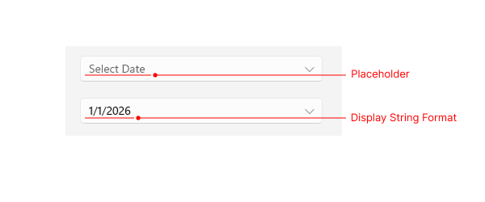
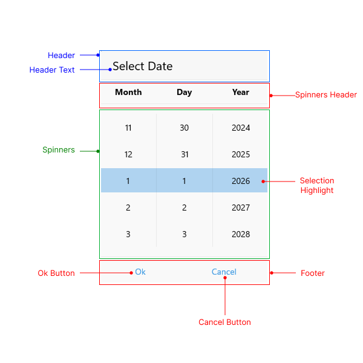

# Visual Structure

The DatePicker uses a set of visual elements when rendered.

## Displayed Elements

- **Placeholder**&mdash;The text that is visualized before picking a date/time. You can customize the placeholder through the [`PlaceholderTemplate`](#placeholdertemplate) property.
- **DisplayStringFormat**&mdash;The text that is visualized after a date/time is picked.
- **Header**&mdash;The text that is displayed in the popup header. You can set it to a text input through the [`HeaderLabelText`](#styling) property, or fully customize it by using the [`HeaderTemplate`](#headertemplate) property.
- **SpinnerHeader**&mdash;The text that is visualized for the spinner header depending on the values that are picked. For example, if the `SpinnerFormatString` is *d*, the visualized text for the spinner header will be **Month** **Day** **Year**.
- **Spinner**&mdash;Displays items in a list.
- **SelectionHighlight**&mdash;Highlights the current selected date when the popup is open.
- **Footer**&mdash;The footer of the popup. By default, it contains the **OK** and **Cancel** buttons. You can customize it through the [`FooterTemplate`](#footertemplate) property.

## DatePicker Structure

The following image shows the structure of the DatePicker before and after a date/time is selected.

## Popup Structure

The following images show the visual structure of the DatePicker popup.

