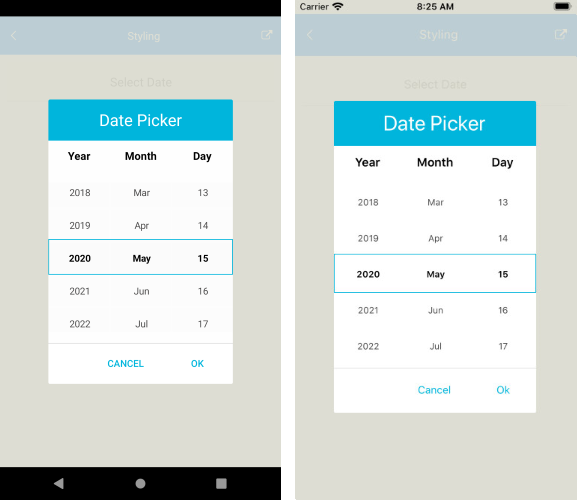

# .NET MAUI DatePicker Styling

The DatePicker control for .NET MAUI provides styling options for customizing its appearance. You can style the DatePicker itself, as well as its popup or dropdown depending on the [PickerMode]() setting.

The control supports the following styling properties:

* `BackgroundColor`&mdash;Defines the background color of the picker.
* `BorderColor`&mdash;Defines the border color of the picker.
* `BorderThickness`&mdash;Specifies the border thickness of the picker. Its default value is `new Thickness(0,0,0,1)`.
* `CornerRadius`&mdash;Specifies the corner radius of the picker.
* `ClearButtonStyle`(of type `Style` with target type `RadButton`)&mdash;Defines the style applied to the [Clear button](#clear-button).
* `ToggleButtonStyle`(of type `Style` with target type `RadButton`)&mdash;Specifies the style of the [Toggle button](##toggle-button).
* `PlaceholderLabelStyle`(of type `Style` with target type `Label`)&mdash;Specifies the style applied to the label defined in the [default PlaceholderTemplate](#default-placeholdertemplate).
* `DisplayLabelStyle`(of type `Style` with target type `Label`)&mdash;Defines the style applied to the label, which is visualized when a date is selected.


The following Style properties are related to the spinner controls inside the popup/dropdown:

* `SpinnerStyle`(of type `Style` with target type `telerik:RadSpinner`)&mdash;Defines the style applied to the spinner item and the selected item.
* `SpinnerHeaderStyle`(of type `Style` with target type `Label`)&mdash;Specifies the style applied to each spinner header label.
* `SelectionHighlightStyle`(of type `Style` with target type `telerik:RadBorder`)&mdash;Specifies the style applied to the border that highlights the selection.

## Styling Examples

The following examples demonstrate how to use the styling properties of the DatePicker.

**Define the `RadDatePicker`**

<snippet id='datepicker-style' />

**Define the Spinner Style**

<snippet id='datepicker-style-spinner-style' />

**Define the SpinnerHeaderStyle**

<snippet id='datepicker-style-spinner-header-style' />

**Define the SelectionHighlightStyle**

<snippet id='datepicker-style-selection-highlight-style' />

**Define the PlaceholderLabelStyle**

<snippet id='datepicker-style-placeholder-label-style' />

**Define the DisplayLabelStyle**

<snippet id='datepicker-style-display-label-style' />

**Define the ClearButtonStyle**

<snippet id='datepicker-style-clear-button-style' />

**Define the ToggleButtonStyle**

<snippet id='datepicker-style-toggle-button-style' />

In addition, add the `telerik` namespaces:

 ```XAML
xmlns:telerik="http://schemas.telerik.com/2022/xaml/maui"
 ```

 
The following image shows what the DatePicker control looks like when the styles described above are applied on different platforms:



## See Also

- [Picker Mode]()
- [Formatting]()
- [Templates]()
- [Commands]()
- [Visual Structure]()
