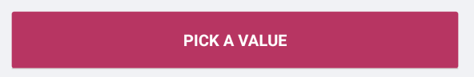
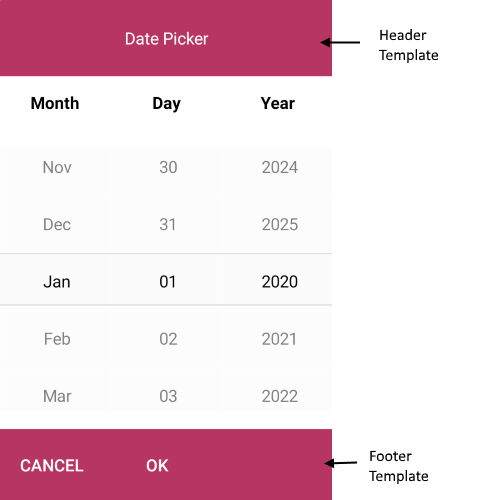

# Customize DatePicker Templates in .NET MAUI

Use the Telerik UI for .NET MAUI DatePicker templates to customize the placeholder area, selected date display, and the popup header and footer. This article helps you choose the correct template for each part of the control and shows how to apply them together.

## Which DatePicker Template Should You Use

Use the following templates depending on the part of the control you want to customize:

| Template | Type | Use It When |
|---|---|---|
| `PlaceholderTemplate` | `ControlTemplate` | You want to change what the control shows before the user picks a date. |
| `DisplayTemplate` | `ControlTemplate` | You want to customize how the selected date appears in the input area. |
| `HeaderTemplate` | `ControlTemplate` | You want to replace or extend the content in the popup header. |
| `FooterTemplate` | `ControlTemplate` | You want to replace or extend the content in the popup footer. |

## Placeholder Template

Use `PlaceholderTemplate` when you want to replace the default placeholder content before the user selects a date.

The following example shows how to use the default `PlaceholderTemplate`:

<snippet id='datepicker-placeholder-default-template' />

## Display Template

Use `DisplayTemplate` when you want to change how the selected date is rendered after the user picks a value.

The following example shows how to use the default `DisplayTemplate`:

<snippet id='datepicker-display-default-template' />

## Header Template

Use `HeaderTemplate` when you want to customize the popup header area.

The following example shows how to use the default `HeaderTemplate`:

<snippet id='datepicker-header-default-template' />

## Footer Template

Use `FooterTemplate` when you want to customize the popup footer area.

The following example shows how to use the default `FooterTemplate`:

<snippet id='datepicker-footer-default-template' />

## Example with Default Templates

After you define the templates in your page resources, assign them to the DatePicker and its selector settings:

```xaml
<telerik:RadDatePicker MinimumDate="2020,01,1"
					   MaximumDate="2025,12,31"
					   DisplayTemplate="{StaticResource Picker_DisplayView_ControlTemplate}"
					   PlaceholderTemplate="{StaticResource Picker_PlaceholderView_ControlTemplate}">
	<telerik:RadDatePicker.SelectorSettings>
		<telerik:PickerPopupSelectorSettings HeaderTemplate="{StaticResource PopupView_Header_ControlTemplate}"
										   HeaderLabelText="Date Picker"
										   FooterTemplate="{StaticResource PopupView_Footer_ControlTemplate}" />
	</telerik:RadDatePicker.SelectorSettings>
</telerik:RadDatePicker>
```

## Customization Example

The following example builds a customized DatePicker step by step.

1. Define a simple DatePicker:

<snippet id='datepicker-custom-templates' />

2. Add the templates to the page resources.

### Define a Custom PlaceholderTemplate

<snippet id='datepicker-placeholder-template' />

The following image shows the custom placeholder template:



### Define a Custom DisplayTemplate

<snippet id='datepicker-display-template' />

The following image shows the custom display template:


### Define a Custom HeaderTemplate

<snippet id='datepicker-header-template' />

### Define a Custom FooterTemplate

<snippet id='datepicker-footer-template' />

3. Add the `telerik` namespace if it is not already declared in your XAML page:

```xaml
xmlns:telerik="http://schemas.telerik.com/2022/xaml/maui"
```

The following image shows customized header and footer templates:



## See Also

- [Formatting the Telerik UI for .NET MAUI DatePicker]()
- [.NET MAUI DatePicker Styling]()
- [.NET MAUI DatePicker Product Page](https://www.telerik.com/maui-ui/datepicker)
