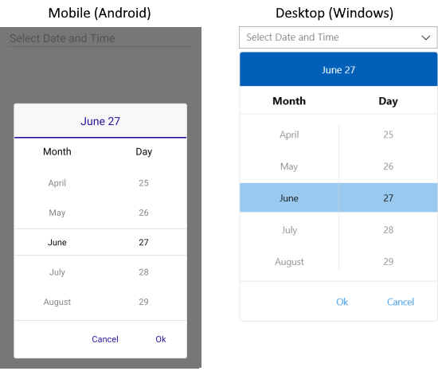
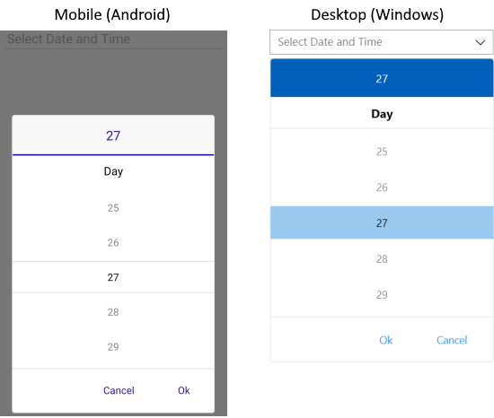
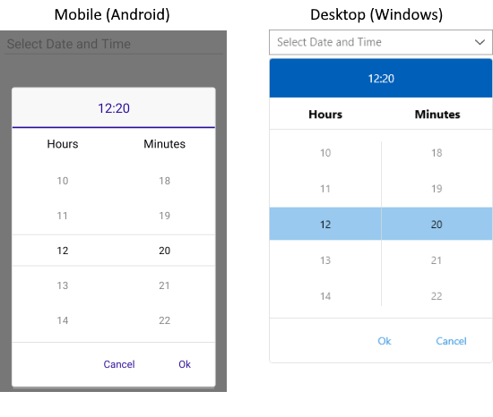

# Formatting

Telerik UI for .NET MAUI DateTimePicker provides formatting options both when the picker dialog is open and when a date value is picked.

## DisplayString Format

The `DisplayStringFormat` property defines the format of the string that will be visualized when the picker dialog is closed.

>note The format set for `DisplayStringFormat` has to be a valid date format.

The following example demonstrates how to set the `DisplayStringFormat` definition.

Define the control and the `DisplayStringFormat`.

```XAML
<telerikInput:RadDateTimePicker DefaultHighlightedDate="2020,05,15"
                                DisplayStringFormat="yyyy/MMM/dd"
                                Placeholder="Pick a date!"
                                SpinnerFormat="dd/MMM/yyyy"
                                AreSpinnerHeadersVisible="False"/>
```

Add the following namespace:

```XAML
xmlns:telerikInput="clr-namespace:Telerik.XamarinForms.Input;assembly=Telerik.Maui.Controls.Compatibility"
```

## Spinner Format

The DateTimePicker allows you to use standard or custom date and time format strings through its `SpinnerFormat` property. Depending on what format is set, the picker visualizes spinner controls with prepopulated values that can be picked.

The `SpinnerFormat` property defines the string format for the spinners. The default format is `"g"`.

## Standard Date and Time Format Strings

The available Standard Date and Time Format Strings, which can be set to the `SpinnerFormat` and `DisplayStringFormat` properties, are described in the following table.

| Supported Standard Date Format String | Description |
| -------- | -------- |
| `"d"` | A Short Date Format. The invariant culture format is `MM/dd/yyyy`. |
| `"G"` | A Short Date `"d"` and Long Time `"T"` specifier. |
| `"g"` | A Short Date `"d"` and Short Time `"t"` specifier. |
| `"M"` | A Month Format specifier. |
| `"m"` | A Month Format specifier. |
| `"Y"` | A Year Month Format specifier. |
| `"y"` | A Year Month Format specifier. |
| `"T"` | Long Time Format Specifier |
| `"t"` | Short Time Format Specifier |

>important You can set only short [Standard Date and Time Format Strings](https://docs.microsoft.com/en-us/dotnet/standard/base-types/standard-date-and-time-format-strings) to the DateTime Picker control.

## Custom Date and Time Format Strings

The available Custom Date and Time Format Strings, which can be set to the `SpinnerFormat` and `DisplayStringFormat` properties, are described in the following table.

The Supported Custom Date and Time Format Strings are: `"d"`, `"dd"`, `"M"`, `"MM"`, `"MMM"`, `"MMMM"`, `"y"`, `"yyy"`, `"yyyy"`, `"H"`, `"HH"`,  `"h"`, `"hh"`, `"m"`, `"mm"`, `"s"`, `"ss"`, `"t"`, `"tt"`.


>important Currently, the DateTimePicker does not support any standard date formats, which contain a long date inside them. For more information, refer to the official Microsoft documentation on [Standard Date and Time Format Strings](https://docs.microsoft.com/en-us/dotnet/standard/base-types/standard-date-and-time-format-strings).

## Supported Separators

When `SpinnerFormat` is set and the device culture is changed, the separators used for the format string won't be changed:

The Supported Date Format Separators are: `"-"`, `"."`, `","`, `" "`, `":"`,`"/"`.

## Examples

The following examples demonstrate how to set the `SpinnerFormat` property of the DateTimePicker to different formats.

### SpinnerFormat="MMMM dd"

```XAML
<telerikInput:RadDateTimePicker SpinnerFormat="MMMM dd" />
```

And the result:



### SpinnerFormat="dd"

```XAML
<telerikInput:RadDateTimePicker SpinnerFormat="dd" />
```

And the result:



### SpinnerFormat="H:mm"

```XAML
<telerikInput:RadDateTimePicker SpinnerFormat="H:mm" />
```

And the result:



## See Also

- [Templates]()
- [Styling]()
- [Selection]()
- [Commands]()
