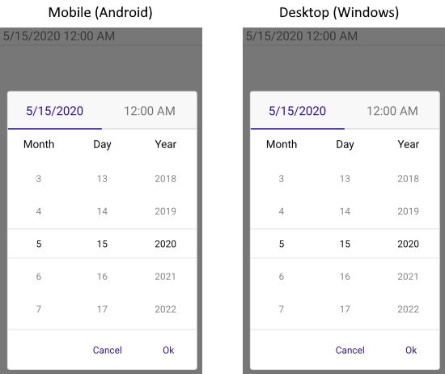
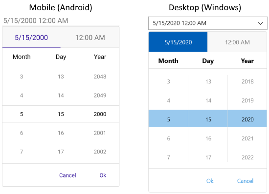

---
title: Picker Mode
page_title: .NET MAUI DateTimePicker Documentation - Picker Mode
description: Define PickerMode of Telerik DateTimePicker for .NET MAUI to either DropDown or Popup.
position: 5
slug: datetimepicker-picker-mode
---  

# .NET MAUI DateTimePicker Modes

The DateTimePicker for .NET MAUI provides a popup and a drop-down picker mode for picking a value from the selector.

## Picker Mode

Use the `PickerMode` (enum of type `Telerik.Maui.Controls.PickerMode`) property to specify which UI to open for selecting a value from the picker selector. The options are:

* `Popup`&mdash;Shows the UI for picking a date and time inside a popup. It's the default value for mobile (Android and iOS);
* `DropDown`&mdash;Opens the UI for picking a date and time inside a drop-down. It's the default value for Desktop (Windows, macOS);

Here is a sample of `PickerMode` set to `Popup`:

```XAML
<telerik:RadDateTimePicker Date="2020,05,15" 
								PickerMode="Popup" />
```

Check below the result on mobile and desktop:



Quick example of `PickerMode` set to `DropDown`:

```XAML
<telerik:RadDateTimePicker Date="2020,05,15" 
							PickerMode="DropDown" />
```

Check the result of `DropDown` mode on mobile and desktop:



## Picker Toggle State

You can control whether the picker popup or drop-down is opened or closed by using the `IsOpen` (`bool`) property.

## Arrow Button Picker Mode

In addition, DateTimePicker exposes `IsToggleButtonVisible` property which when set to `True` renders an "arrow" button for opening the UI for picking a date. By default, `IsToggleButtonVisible` is enabled for Desktop and is disabled for mobile platforms. You can explicitly apply it in both cases:

```XAML
<telerik:RadDateTimePicker Date="2020,05,15"
								PickerMode="DropDown"
								IsToggleButtonVisible="True" />
```

## See Also

- [Templates]()
- [Styling]()
- [Commands]()
- [Selection]()
