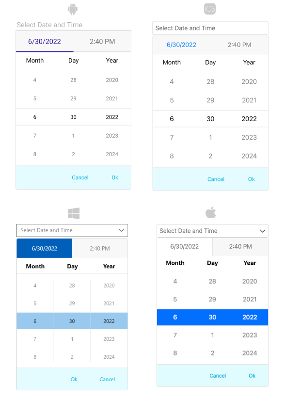

# .NET MAUI DateTimePicker Drop-Down Styling

By using the `DropDownSettings` property (of type `Telerik.Maui.Controls.PickerDropDownSettings`) of the DateTimePicker, you can modify the appearance of the drop-down. The `PickerDropDownSettings` class exposes the following `Style` properties:

* `DropDownViewStyle`(of type `Style` with target type `telerik:PickerDropDownContentView`)&mdash;Defines the drop-down view style.
* `FooterStyle`(of type `Style` with target type `telerik:PickerPopupFooterView`)&mdash;Defines the drop-down footer style.
* `AcceptButtonStyle`(of type `Style` with target type `Button`)&mdash;Defines the **Accept** button style.
* `CancelButtonStyle`(of type `Style` with target type `Button`)&mdash;Defines the **Cancel** button style.

The `DropDownSettings` also provides the following properties for drop-down customization:

* `Placement`(of type `PlacementMode`)&mdash;Specifies the position of the drop-down, can be set to Bottom, Right, Left, Top, Center or Relative.
* `HorizontalOffset` \ `VerticalOffset`&mdash;Specifies the horizontal\vertical distance between the drop-down and the DateTimePicker.
* `IsFooterVisible`(`bool`)&mdash;Specifies whether the drop-down footer is currently visible. By default, the value is `True`.
* `AcceptButtonText`(`string`)&mdash;Defines the text visualized for the `Accept` button. By default, the text is `OK`.
* `CancelButtonText`(`string`)&mdash;Defines the text visualized for the `Cancel` button. By default, the text is `Cancel`.

> `DropDownSettings` provides styling options for the drop-down, its footer and position, and other. If you need to customize the look&feel of the spinner controls that show the available date values, please refer to `SpinnerStyle`, `SpinnerHeaderStyle` and `SelectionHighlightStyle` properties of the DateTimePicker. For more detailed information on them go to [DateTimePicker Styling]() topic.

## Namespaces

When you use `DropDownViewStyle`, `FooterStyle`, you will need to add the following namespace:

 ```XAML
xmlns:telerik="http://schemas.telerik.com/2022/xaml/maui"
 ```

## Styling Examples

The following examples demonstrate how to define use the styling properties of the DateTimePicker.

**Define the `RadDateTimePicker`**

<snippet id='datetimepicker-dropdown-style' />

**Define the DropDownViewStyle**

<snippet id='datepicker-style-dropdownview-style' />

**Define the Footer Style**

<snippet id='datetimepicker-style-footer-style' />

**Define the AcceptButton Style**

<snippet id='datetimepicker-style-accept-button-style' />

**Define the CancelButton Style**

<snippet id='datetimepicker-style-cancel-button-style' />


In addition, add the following namespaces:

 ```XAML
xmlns:telerik="http://schemas.telerik.com/2022/xaml/maui"
 ```

The following image shows what the DateTimePicker control looks like when the styles described above are applied:



## See Also

- [DateTimePicker Styling]()
- [Formatting]()
- [Visual Structure]()
