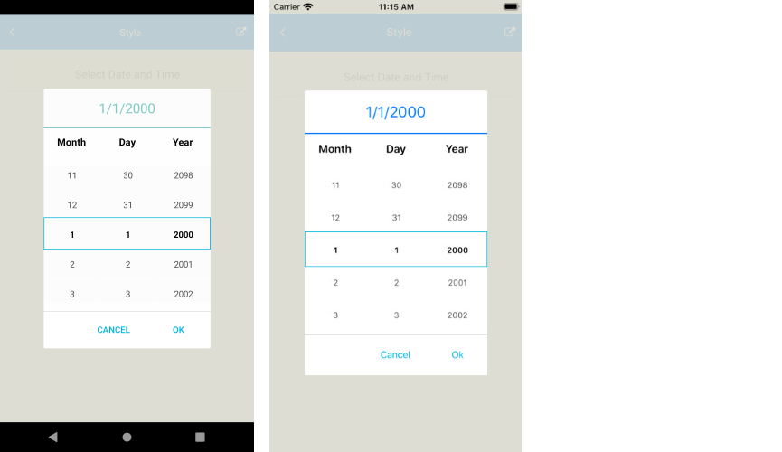

# .NET MAUI DateTimePicker Styling

The DateTimePicker control for .NET MAUI provides styling options for customizing its appearance. You can style the DateTimePicker itself, as well as its popup or dropdown depending on the [PickerMode]() setting.


The control supports the following styling properties:

* `BackgroundColor`&mdash;Defines the background color of the picker.
* `BorderColor`&mdash;Defines the border color of the picker.
* `BorderThickness`&mdash;Specifies the border thickness of the picker. Its default value is `new Thickness(0,0,0,1)`.
* `CornerRadius`&mdash;Specifies the corner radius of the picker.
* `ClearButtonStyle`(of type `Style` with target type `RadButton`)&mdash;Defines the style applied to the [Clear button](#clear-button).
* `ToggleButtonStyle`(of type `Style` with target type `RadButton`)&mdash;Specifies the style of the [Toggle button](##toggle-button).
* `PlaceholderLabelStyle`(of type `Style` with target type `Label`)&mdash;Specifies the style applied to the label defined in the [default PlaceholderTemplate](#default-placeholdertemplate).
* `DisplayLabelStyle`(of type `Style` with target type `Label`)&mdash;Defines the style applied to the label, which is visualized when a date is selected.
* `TabStripItemStyle`(of type `Style` with target type `telerik:TabViewHeaderItem`)&mdash;Specifies the style applied to the separate tab items.

The following Style properties are related to the spinner controls inside the popup/dropdown:


* `SpinnerStyle`(of type `Style` with target type `telerik:RadSpinner`)&mdash;Defines the style applied to the spinner item and the selected item.
* `SpinnerHeaderStyle`(of type `Style` with target type `Label`)&mdash;Specifies the style applied to each spinner header label.
* `SelectionHighlightStyle`(of type `Style` with target type `telerik:RadBorder`)&mdash;Specifies the style applied to the border that highlights the selection.

## Namespaces

When you use `SelectionHighlightStyle`, you need to add the following namespace:

 ```XAML
xmlns:telerik="http://schemas.telerik.com/2022/xaml/maui"
 ```

The same namespace can also be used for the `SpinnerStyle`.

## Styling Examples

The following examples demonstrate how to define use the styling properties of the DateTimePicker.

**Define the `RadDateTimePicker`**

<snippet id='datetimepicker-style' />

**Define the Spinner Style**

<snippet id='datetimepicker-style-spinner-style' />

**Define the SpinnerHeader Style**

<snippet id='datetimepicker-style-spinner-header-style' />

**Define the SelectionHighlight Style**

<snippet id='datetimepicker-style-selection-highlight-style' />

**Define the PlaceholderLabel Style**

<snippet id='datetimepicker-style-placeholder-label-style' />

**Define the DisplayLabel Style**

<snippet id='datetimepicker-style-display-label-style' />

**Define the ClearButtonStyle**

<snippet id='datepicker-style-clear-button-style' />

**Define the ToggleButtonStyle**

<snippet id='datepicker-style-toggle-button-style' />

The following image shows what the DateTimePicker control looks like when the styles described above are applied:



## See Also

- [Picker Mode]()
- [Formatting]()
- [Templates]()
- [Commands]()
- [Visual Structure]()
