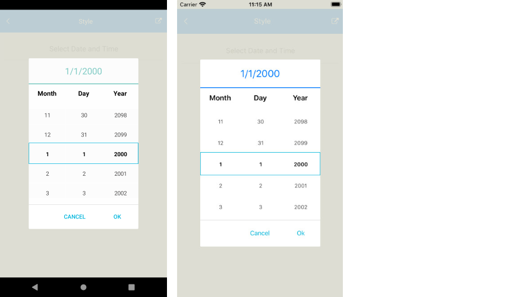

# .NET MAUI DateTimePicker Styling

Use the .NET MAUI DateTimePicker styling API to customize the input area and the popup or dropdown content. You can also style the buttons that switch between date and time selection based on the [PickerMode]() setting.

## Choose the Correct Style Property

Use the following properties to style the DateTimePicker:

* `BackgroundColor`&mdash;Defines the background color of the picker.
* `BorderColor`&mdash;Defines the border color of the picker.
* `BorderThickness`&mdash;Specifies the border thickness of the picker. Its default value is `new Thickness(0,0,0,1)`.
* `CornerRadius`&mdash;Specifies the corner radius of the picker.
* `ClearButtonStyle` (type `Style` with target type `RadButton`)&mdash;Defines the style applied to the [Clear button](#clear-button).
* `ToggleButtonStyle` (type `Style` with target type `RadButton`)&mdash;Specifies the style of the [toggle button](#toggle-button) that opens the popup or dropdown.
* `PlaceholderLabelStyle` (type `Style` with target type `Label`)&mdash;Specifies the style applied to the label defined in the [default placeholder template](#default-placeholdertemplate).
* `DisplayLabelStyle` (type `Style` with target type `Label`)&mdash;Defines the style applied to the label that is displayed when a date or time is selected.
* `TabStripItemStyle` (type `Style` with target type `telerik:TabViewHeaderItem`)&mdash;Specifies the style applied to the Date and Time tab buttons inside the popup or dropdown.

The following style properties apply to the spinner controls inside the popup or dropdown:

* `SpinnerStyle` (type `Style` with target type `telerik:RadSpinner`)&mdash;Defines the style applied to the spinner item and the selected item.
* `SpinnerHeaderStyle` (type `Style` with target type `Label`)&mdash;Specifies the style applied to each spinner header label.
* `SelectionHighlightStyle` (type `Style` with target type `telerik:RadBorder`)&mdash;Specifies the style applied to the border that highlights the selection.

## Namespaces

When the style targets a Telerik control, use the following namespace in your XAML page:

```xaml
xmlns:telerik="http://schemas.telerik.com/2022/xaml/maui"
```

## Styling Examples

The following examples show how to apply the DateTimePicker styling properties:

### Define the `RadDateTimePicker`

<snippet id='datetimepicker-style' />

### Define the `SpinnerStyle`

<snippet id='datetimepicker-style-spinner-style' />

### Define the `SpinnerHeaderStyle`

<snippet id='datetimepicker-style-spinner-header-style' />

### Define the `SelectionHighlightStyle`

<snippet id='datetimepicker-style-selection-highlight-style' />

### Define the `PlaceholderLabelStyle`

<snippet id='datetimepicker-style-placeholder-label-style' />

### Define the `DisplayLabelStyle`

<snippet id='datetimepicker-style-display-label-style' />

### Define the `ClearButtonStyle`

<snippet id='datepicker-style-clear-button-style' />

### Define the `ToggleButtonStyle`

<snippet id='datepicker-style-toggle-button-style' />

The following image shows what the DateTimePicker control looks like when the styles described above are applied:



## See Also

- [Picker Mode]()
- [Formatting]()
- [Templates]()
- [Commands]()
- [Visual Structure]()
