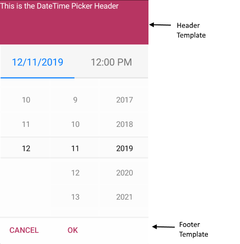

# Customize DateTimePicker Templates in .NET MAUI

Use the Telerik UI for .NET MAUI DateTimePicker templates to customize the placeholder area, selected value display, and the popup header and footer. This article helps you choose the correct template for each part of the control and shows how to apply them together.

## Which DateTimePicker Template Should You Use

Use the following templates depending on the part of the control that you want to customize:

| Template | Type | Use It When |
|---|---|---|
| `PlaceholderTemplate` | `ControlTemplate` | You want to change what the control shows before the user picks a value. |
| `DisplayTemplate` | `ControlTemplate` | You want to customize how the selected date or time appears in the input area. |
| `HeaderTemplate` | `ControlTemplate` | You want to replace or extend the content in the popup header. |
| `FooterTemplate` | `ControlTemplate` | You want to replace or extend the content in the popup footer. |

## PlaceholderTemplate

Use `PlaceholderTemplate` when you want to replace the default placeholder content before the user selects a date or time.

The following example shows how to use `PlaceholderTemplate`:

<snippet id='datepicker-placeholder-default-template' />

## DisplayTemplate

Use `DisplayTemplate` when you want to change how the selected value is rendered after the user picks a date or time.

The following example shows how to use `DisplayTemplate`:

<snippet id='datepicker-display-default-template' />

## HeaderTemplate

Use `HeaderTemplate` when you want to customize the popup header area.

The following example shows how to use `HeaderTemplate`:

<snippet id='datepicker-header-default-template' />

## FooterTemplate

Use `FooterTemplate` when you want to customize the popup footer area.

The following example shows how to use `FooterTemplate`:

<snippet id='datepicker-footer-default-template' />

## How Do You Apply All Templates to One DateTimePicker

After you define the templates in your page resources, assign them to the DateTimePicker and its selector settings:

```xaml
<telerik:RadDateTimePicker MinimumDate="2020,01,1"
                            MaximumDate="2025,12,31"
                            SpinnerFormat="MMM/dd/yyyy"
                            PlaceholderTemplate="{StaticResource Picker_PlaceholderView_ControlTemplate}"
                            DisplayTemplate="{StaticResource Picker_DisplayView_ControlTemplate}">
    <telerik:RadDateTimePicker.SelectorSettings>
        <telerik:PickerPopupSelectorSettings HeaderTemplate="{StaticResource PopupView_Header_ControlTemplate}"
                                           HeaderLabelText="Date Picker"
                                           FooterTemplate="{StaticResource PopupView_Footer_ControlTemplate}" />
    </telerik:RadDateTimePicker.SelectorSettings>
</telerik:RadDateTimePicker>
```

In this example:

- `PlaceholderTemplate` customizes the empty state of the control.
- `DisplayTemplate` customizes the selected value area.
- `HeaderTemplate` and `FooterTemplate` customize the popup content.

## Customization Examples

The following example builds a customized DateTimePicker step by step.

1. Define a simple DateTimePicker:

<snippet id='datepicker-custom-templates' />

2. Add the templates to the page resources.

### Define a Custom PlaceholderTemplate

<snippet id='datepicker-placeholder-template' />

The following image shows the custom placeholder template:


### Define a Custom DisplayTemplate

<snippet id='datepicker-display-template' />

The following image shows the custom display template:


### Define a Custom HeaderTemplate

<snippet id='datepicker-header-template' />

### Define a Custom FooterTemplate

<snippet id='datepicker-footer-template' />

3. Add the `telerik` namespace if it is not already declared in your XAML page:

```xaml
xmlns:telerik="http://schemas.telerik.com/2022/xaml/maui"
```

The following image shows customized header and footer templates:



## See Also

- [Formatting]()
- [Date Range]()
- [Styling]()
