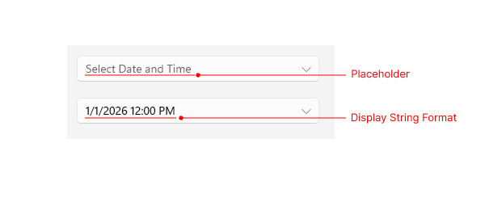
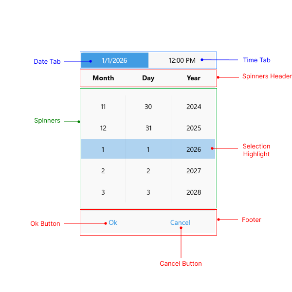

# .NET MAUI DateTimePicker Visual Structure

The visual structure of the .NET MAUI DateTimePicker represents the anatomy of the UI control. Being familiar with the visual elements of the DateTimePicker allows you to quickly find the information required to configure them.

The images in this article show the anatomy of the DateTimePicker and its building blocks.

## DateTimePicker Structure

- **Placeholder**&mdash;The text that is visualized before picking a date/time. You can customize the placeholder through the [`PlaceholderTemplate`](#placeholdertemplate) property.
- **Display String Format**&mdash;The text that is visualized after a date and time is picked.

## Popup Structure

- **Header**&mdash;The text that is displayed in the popup header. You can set it to a text input through the [`HeaderLabelText`](#styling) property, or customize it by using the [`HeaderTemplate`](#headertemplate) property.
- **Date Tab**&mdash;Represents the date section of the popup.
- **Time Tab**&mdash;Represents the time section of the popup.
- **Spinners Header**&mdash;The text that is visualized for the spinner header depending on the values that are picked. For example, if the `SpinnerFormatString` is `d`, and `AreSpinnerHeadersVisible` property is set to `True` the visualized text for the spinner header will be `Month` ,`Day`,`Year`.
- **Spinners**&mdash;Displays items in a list. For `d` format, three spinners will be visualized: one for month, one for day, and one for year.
- **SelectionHighlight**&mdash;Highlights the current selected date and time when the popup is open.
- **Footer**&mdash;The footer of the popup. By default, it contains the **OK** and **Cancel** buttons. You can customize it through the [`FooterTemplate`](#footertemplate) property.

## See Also

- [Getting Started]()
- [Formatting]()
- [Date Range]()
- [Templates]()
- [Selection]()
- [Styling]()