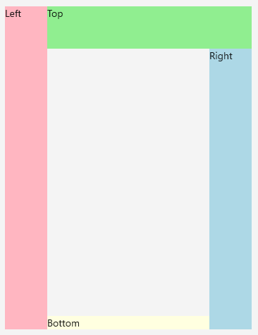

# Adaptable Docking

By default, the last element inside the DockLayout stretches over the remaining space that is not occupied by the other child elements.

You can prevent this behavior by setting **StretchLastChild** property of the DockLayout control to *False* as demonstrated in the following example.

<snippet id='docklayout-position-lastelement'/>
```XAML
<telerik:RadDockLayout x:Name="dockLayout" StretchLastChild="False">
    <Label Text="Left" telerik:RadDockLayout.Dock="Left" WidthRequest="60" BackgroundColor="LightPink" />
    <Label Text="Top" telerik:RadDockLayout.Dock="Top" HeightRequest="60" BackgroundColor="LightGreen" />
    <Label Text="Right" telerik:RadDockLayout.Dock="Right" WidthRequest="60" BackgroundColor="LightBlue" />
    <Label Text="Bottom" telerik:RadDockLayout.Dock="Bottom" BackgroundColor="LightYellow" />
</telerik:RadDockLayout>
```

And here is how it looks:



## See Also

* [Positioning Child Elements]()
