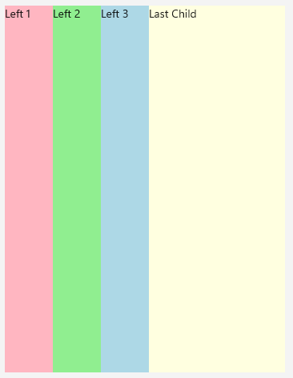

# Positioning Child Elements

The DockLayout provides options for setting the position of child elements to different areas of the layout and aligning multiple elements to one side.  

## Setting the Position

To define the docking side of a child element inside the dock layout component, use **RadDockLayout.Dock** attached property which receives any of the following values:

* `Left`
* `Top`
* `Right`
* `Bottom`

The way the child elements are docked and arranged depends on their order inside the DockLayout’s Children collection (the order they’re defined in XAML).

Following is a quick example on how you can utilize the docking functionality:

<snippet id='docklayout-docking-feature' />
```XAML
<telerik:RadDockLayout x:Name="dockLayout">
    <Label Text="Left" telerik:RadDockLayout.Dock="Left" WidthRequest="60" BackgroundColor="LightPink" />
    <Label Text="Top" telerik:RadDockLayout.Dock="Top" HeightRequest="60" BackgroundColor="LightGreen" />
    <Label Text="Right" telerik:RadDockLayout.Dock="Right" WidthRequest="60" BackgroundColor="LightBlue" />
    <Label Text="Bottom" telerik:RadDockLayout.Dock="Bottom" BackgroundColor="LightYellow" />
</telerik:RadDockLayout>
```

where *telerik* is defined like this:

```XAML
xmlns:telerik="clr-namespace:Telerik.Maui.Controls;assembly=Telerik.Maui.Controls"
```

Check the result on different platforms below:


## Positioning Multiple Elements on One Side

Setting the same docking side to a few child elements will arrange them according to their order inside the DockLayout’s Children collection.  

<snippet id='docklayout-position-elementsoneside'/>
```XAML
<telerik:RadDockLayout x:Name="dockLayout" >
    <Label Text="Left 1" telerik:RadDockLayout.Dock="Left" WidthRequest="60" BackgroundColor="LightPink" />
    <Label Text="Left 2" telerik:RadDockLayout.Dock="Left" WidthRequest="60" BackgroundColor="LightGreen" />
    <Label Text="Left 3" telerik:RadDockLayout.Dock="Left" WidthRequest="60" BackgroundColor="LightBlue" />
    <Label Text="Last Child" telerik:RadDockLayout.Dock="Left" BackgroundColor="LightYellow" />
</telerik:RadDockLayout>
```

And the result is:



## See Also

* [Using Adaptable Docking]()
