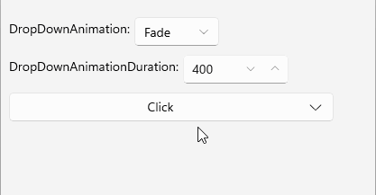

# .NET MAUI DropDownButton Animation

The .NET MAUI DropDownButton provides animation when the drop-down part of the control is opened or closed. The animation is enabled by default and can be configured by using the following properties:

* `DropDownAnimation` (enum of type `Telerik.Maui.Controls.PopupAnimationType`)&mdash;Defines the animation type when the drop-down part of the control is opened or closed. The available options are:
    * (Default)`Slide`
    * `None`
    * `Fade`
    * `Zoom`

* `DropDownAnimationDuration` (`int`)&mdash;Defines the duration of the drop-down opening and closing animation in milliseconds. The default value is `220`.
* `DropDownAnimationEasing` (`Microsoft.Maui.Easing`)&mdash;Defines the easing function for the drop-down opening and closing animation. The default value is `Easing.Linear`.

## Example

The following example demonstrates how to configure the drop-down animation for the DropDownButton.

**1.** Define the button in XAML:

<snippet id='dropdownbutton-dropdownstyling-animation-fade' />

**2.** Add the `telerik` namespace:

```XAML
xmlns:telerik="http://schemas.telerik.com/2022/xaml/maui"
```

This is the result on WinUI:



> For a runnable example demonstrating the DropDownButton animation options, see the [SDKBrowser Demo Application]() and go to the **DropDownButton > Features** category.

## See Also

- [Configure the Button Content and Indicator]()
- [Configure the Drop-Down Part]()
- [Style the DropDownButton]()
- [Command]()
- [Events]()
