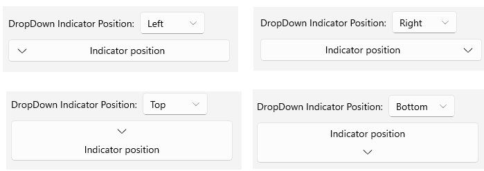
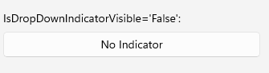

# .NET MAUI DropDownButton Configuration

The purpose of this help article is to show you the main configuration options of the DropDownButton.

## Setting Content

Define the content inside the DropDownButton by setting the `Content` property (`object`) or `ContentTemplate` (`DataTemplate`) property.

The `Content` is responsible for the actual content displayed in the button. It can be set to `string`, `View`, object, etc.

Here are the scenarios for the visualization of `Content` or `ContentTemplate` inside the `RadDropDownButton`:

* If `ContentTemplate` is set, the `View` returned from the `ContentTemplate`.`CreateView()` is displayed inside the `RadDropDownButton.ControlTemplate`, having `Content` as its `BindingContext`.

* If `ContentTemplate` is `DataTemplateSelector`, first the `DataTemplate` is selected and then a `View` is created from the chosen template using `Content` as its `BindingContext`.

* If `Content` is set to a `View` and `ContentTemplate` isn't set, the `View` is displayed inside the `RadDropDownButton.ControlTemplate`.

* If `Content` is set to a `string` and `ContentTemplate` isn't set, a `Label` is displayed inside the `RadDropDownButton.ControlTemplate`.

* If `Content` is set to an `object` and `ContentTemplate` isn't set, the `ToString()` of the `object` is used and converted to `Label` inside the `RadDropDownButton.ControlTemplate`.

This is an example of setting `Content` to a `string`:

<snippet id='dropdownbutton-gettingstarted' />

## Drop-Down Indicator Configuration

The DropDownButton allows you to configure the indicator position, visibility, and style.

### Setting Drop-Down Indicator Position

Use the `DropDownIndicatorPosition` (enum of type `Telerik.Maui.Controls.DropDownButton.DropDownButtonIndicatorPosition`) property to set the position of the drop-down indicator, presented inside the `RadDropDownButton`. The available options are:

* (Default)`Right`&mdash;The drop-down indicator is positioned to the right of the content.
* `Left`&mdash;The drop-down indicator is positioned to the left of the content.
* `Top`&mdash;The drop-down indicator is positioned above the content.
* `Bottom`&mdash;The drop-down indicator is positioned below the content.

This is an example of setting the `DropDownIndicatorPosition` to `Left`:

<snippet id='dropdownbutton-buttonconfiguration-indicatorposition' />

### Setting Drop-Down Indicator Visibility

Use the `IsDropDownIndicatorVisible` (`bool`) property to show or hide the drop-down indicator, presented inside the `RadDropDownButton`.

This is an example of setting the `IsDropDownIndicatorVisible` to `False`:

<snippet id='dropdownbutton-buttonconfiguration-indicatorvisible' />

## Text Alignment

Use the following properties to align the text in the button when `Content` is `string` and `ContentTemplate` is not set.

* `HorizontalTextAlignment` (`Microsoft.Maui.TextAlignment`)&mdash;Specifies the horizontal alignment of the `Label.Text`. 
* `VerticalTextAlignment` (`Microsoft.Maui.TextAlignment`)&mdash;Specifies the vertical alignment of the `Label.Text`.

## Text Decoration

Use the `TextDecorations` (enum of type `Microsoft.Maui.TextDecorations`) property to specify the text decorations of the `Label` created when `Content` is `string` and `ContentTemplate` is not set.

## Font Options

The following properties specify the font options that apply to the content when `Content` is `string` and `ContentTemplate` is not set.

* `FontFamily` (`string`)&mdash;Specifies the font family of the `Label.Text`.
* `FontSize` (`double`)&mdash;Specifies the font size in pixels of the `Label.Text`.
* `FontAttributes` (`Microsoft.Maui.Controls.FontAttributes`)&mdash;Specifies the font attributes of the `Label.Text`.

## (Desktop-only) Auto-Open Behavior

The DropDownButton allows you to configure the auto-open behavior of the drop-down part of the button on desktop platforms through the `AutoOpenDelay` (`TimeSpan`) property. The default value is `Zero`.

Setting a non-zero value to the `AutoOpenDelay` property will trigger the drop-down to open after the specified time has passed while the mouse pointer is hovering over the button. This behavior is available on Windows and Mac Catalyst.

This is an example of setting the `AutoOpenDelay` to `1` second:

<snippet id='dropdownbutton-autoopendelay' />

## See Also

- [Configure the Drop-Down Part]()
- [Style the DropDownButton]()
- [Command]()
- [Events]()
- [Animation]()
