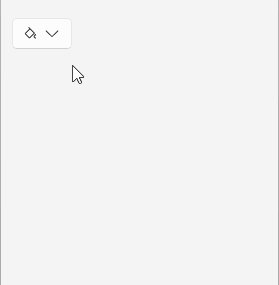
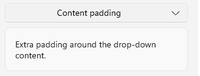
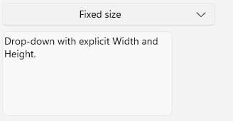
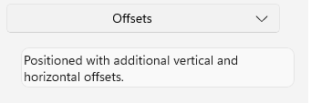
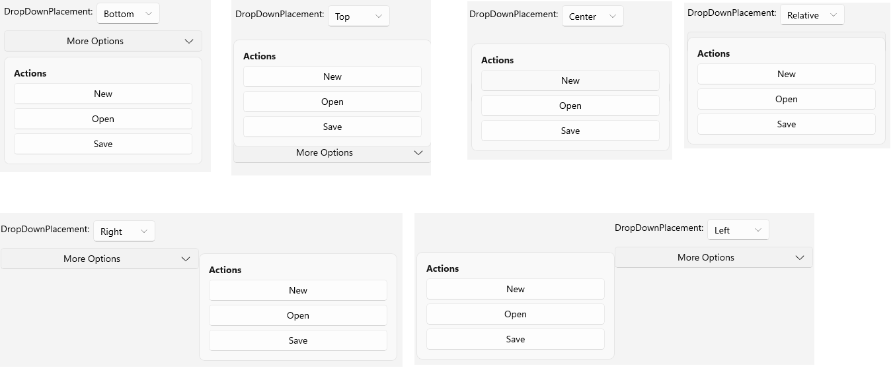

# .NET MAUI DropDownButton Drop-Down Configuration

The purpose of this help article is to show you the main configuration options of the control.

## Setting Content

Define the content inside the drop-down part of the button by setting the `DropDownContent` property (`View`) or `DropDownContentTemplate` (`DataTemplate`) property.

### Setting DropDownContent

<snippet id='dropdownbutton-gettingstarted' />
<snippet id='dropdownbutton-gettingstarted-list-content' />

### Setting DropDownContentTemplate

<snippet id='dropdownbutton-templates-datatemplate' />

## Setting Content Padding

Use the `DropDownContentPadding` (`Thickness`) property to define the inner spacing between the drop-down border and the content displayed in the drop-down part of the `RadDropDownButton`.

This is an example of setting the `DropDownContentPadding` property.

<snippet id='dropdownbutton-dropdownconfiguration-contentpadding' />

## Setting Size

Use the following properties to control the size constraints of the drop-down part of the `RadDropDownButton`:

* `DropDownWidth` (`double`)&mdash;Defines the width of the drop-down. When the value is not set explicitly, the drop-down width matches the width of the `View` displayed as `DropDownContent`.
* `DropDownHeight` (`double`)&mdash;Defines the height of the drop-down.
* `DropDownMinWidth` (`double`)&mdash;Defines the minimum width of the drop-down.
* `DropDownMinHeight` (`double`)&mdash;Defines the minimum height of the drop-down.
* `DropDownMaxWidth` (`double`)&mdash;Defines the maximum width of the drop-down.
* `DropDownMaxHeight` (`double`)&mdash;Defines the maximum height of the drop-down.

This is an example of defining the size of the drop-down part of the `RadDropDownButton` using the size-related properties.

<snippet id='dropdownbutton-dropdownconfiguration-size' />

## Setting Offset

Use the following properties to offset the drop-down relative to the button:

* `DropDownHorizontalOffset` (`double`)&mdash;Defines the horizontal offset of the drop-down.
* `DropDownVerticalOffset` (`double`)&mdash;Defines the vertical offset of the drop-down.

This is an example of setting the horizontal and vertical offset properties.

<snippet id='dropdownbutton-dropdownconfiguration-offsets' />

## Setting Placement

Use the `DropDownPlacement` (enum of type `Telerik.Maui.Controls.PlacementMode`) property to define where the drop-down is displayed relative to the button. The available options are:

* (Default)`Bottom`&mdash;Displays the drop-down below the button.
* `Right`&mdash;Displays the drop-down to the right of the button.
* `Left`&mdash;Displays the drop-down to the left of the button.
* `Top`&mdash;Displays the drop-down above the button.
* `Center`&mdash;Displays the drop-down centered over the placement target.
* `Relative`&mdash;Displays the drop-down according to the configured offsets and placement target.

The `DropDownPlacement` property works together with `DropDownHorizontalOffset` and `DropDownVerticalOffset`, allowing you to position the drop-down for different layouts.

This is an example of setting the `DropDownPlacement` property to `Top`.

<snippet id='dropdownbutton-placement' />

## See Also

- [Configure the Button Content and Indicator]()
- [Style the DropDownButton]()
- [Command]()
- [Events]()
- [Animation]()
