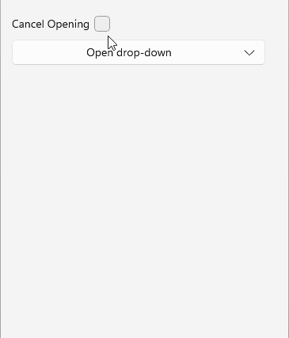

# .NET MAUI DropDownButton Events

The .NET MAUI DropDownButton emits a set of events that allow you to configure the component's behavior in response to specific user actions.

The .NET MAUI DropDownButton exposes the following events:

* `Opening`&mdash;Raised when the `RadDropDownButton.IsOpen` property is changing to `true`. The `Opening` event handler receives two parameters:
	* The `sender` argument which is of type `RadDropDownButton`.
	* A `CancelEventArgs` object which provides an option to cancel the `Opening` event by using the `Cancel`(`bool`) property.

* `Opened`&mdash;Raised when the drop-down is fully opened, including the completion of any open animation. The `Opened` event handler receives two parameters:
	* The `sender` argument which is of type `RadDropDownButton`.
	* An `EventArgs` object which provides information about the `Opened` event.

* `Closed`&mdash;Raised when the drop-down is fully closed, including the completion of any close animation. The `Closed` event handler receives two parameters:
	* The `sender` argument which is of type `RadDropDownButton`.
	* An `EventArgs` object which provides information about the `Closed` event.

The `RadDropDownButton` inherits the `Clicked`, `Pressed`, and `Released` events from the `RadTemplatedButton`.

## Using the Opening, Opened and Closed Events

The following example demonstrates how to use the `Opening`, `Opened`, and `Closed` events.

**1.** Define the button in XAML:

<snippet id='dropdownbutton-events' />

**2.** Add the `telerik` namespace:

```XAML
xmlns:telerik="http://schemas.telerik.com/2022/xaml/maui"
```

**3.** Add the `Opening`, `Opened` and `Closed` event handlers:

<snippet id='dropdownbutton-events-handlers' />

This is the result on WinUI:



> For a runnable example demonstrating the DropDownButton events, see the [SDKBrowser Demo Application]() and go to the **DropDownButton > Features** category.

## See Also

- [Configure the Button Content and Indicator]()
- [Configure the Drop-Down Part]()
- [Style the DropDownButton]()
- [Command]()
- [Animation]()
