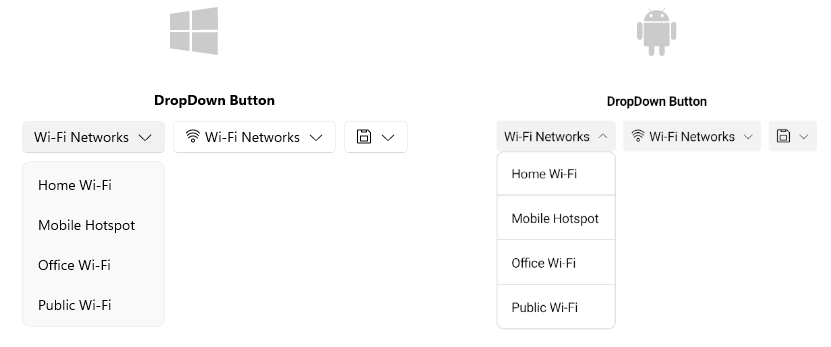

# .NET MAUI DropDownButton Overview

The Telerik UI for .NET MAUI DropDownButton is a combination of a button and a dropdown. A popup (dropdown) menu displays when the button is clicked. The DropDownButton provides various options for customizing its look and feel. In addition, you can open the dropdown from different positions, such as `Bottom`, `Top`, `Left`, and `Right`. 

## Key Features of the .NET MAUI DropDownButton

* [Visual states]()&mdash;You can change the DropDownButton appearance for different visual states like, `Normal`, `Pressed`, `PointerOver` (desktop-only), and `Disabled`.
* [Exhaustive number of events]()&mdash;You can use the events exposed by the DropDownButton to execute various operations on user interactions such as click, press, and release.
* [Command]()&mdash;The DropDownButton provides a command, that executes when the button is clicked.
* [Styling]()&mdash;You can apply different styling options to the button such as changing its background color, border color, border thickness, and more.

## Next Steps

- [Getting Started with Telerik UI for .NET MAUI DropDownButton]()

## See Also

- [.NET MAUI DropDownButton Product Page](https://www.telerik.com/maui-ui/dropdownbutton)
- [.NET MAUI DropDownButton Forum Page](https://www.telerik.com/forums/maui?tagId=1764)
- [Telerik .NET MAUI Blogs](https://www.telerik.com/blogs/mobile-net-maui)
- [Telerik .NET MAUI Roadmap](https://www.telerik.com/support/whats-new/maui-ui/roadmap)