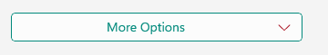
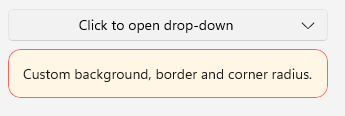

# .NET MAUI DropDownButton Styling

The DropDownButton provides a set of styling options by exposing properties for customizing its visual appearance.

## Styling the DropDownButton

To style the DropDownButton, you can use the following properties:

* `Background` (`Brush`)&mdash;Specifies the background brush of the control.
* `BorderBrush` (`Brush`)&mdash;Specifies the border brush of the control.
* `BorderColor` (`Color`)&mdash;Specifies the border color of the control.
* `BorderThickness` (`Thickness`)&mdash;Specifies the border thickness of the control.
* `CornerRadius` (`CornerRadius`)&mdash;Specifies the corner radius of the control.
* `Padding` (`Thickness`)&mdash;Specifies the padding of the control.
* `TextColor` (`Color`)&mdash;Specifies the color of the `Label.Text` created when `Content` is `string` and `ContentTemplate` is not set.
* All properties from the [Button Configuration]() article can be applied through style.

## Styling the Drop-Down

To style the drop-down part of the DropDownButton, use the following properties:

* `DropDownBackgroundColor` (`Color`)&mdash;Specifies the background color of the drop-down.
* `DropDownBorderColor` (`Color`)&mdash;Specifies the border color of the drop-down.
* `DropDownBorderThickness` (`Thickness`)&mdash;Specifies the border thickness of the drop-down.
* `DropDownCornerRadius` (`Thickness`)&mdash;Specifies the corner radius of the drop-down border.
* `DropDownContentPadding` (`Thickness`)&mdash;Specifies the inner padding of the drop-down content area.

## Styling the Drop-Down Indicator

Use the `DropDownIndicatorStyle` (`Style` with target type `Label`) property to style the drop-down indicator visual displayed inside the `RadDropDownButton`.
You can define the `TextColor`, `FontSize`, `FontFamily`, etc. to customize the drop-down indicator.

The DropDownButton uses the .NET MAUI Visual State Manager and defines a visual state group named `CommonStates` with the following visual states:

* `Normal`
* `Opened`
* `MouseOver`
* `FocusedMouseOver`
* `Pressed`
* `FocusedPressed`
* `Focused`
* `Disabled`

### Example of Styling the DropDownButton

The following example demonstrates how to apply styling to the DropDownButton using the visual states.

**1.** Define the DropDownButton in XAML:

<snippet id='dropdownbutton-buttonstyling-apply' />

**2.** Define the visual states in the page's resources:

<snippet id='dropdownbutton-buttonstyling-styles' />

**3.** Add the `telerik` namespace:

```XAML
xmlns:telerik="http://schemas.telerik.com/2022/xaml/maui"
```

This is the result on WinUI:



> For a runnable example demonstrating the DropDownButton styling options, see the [SDKBrowser Demo Application]() and go to the **DropDownButton > Styling** category.

### Example of Styling the Drop-Down

The following example demonstrates how to apply styling to the drop-down part of the button.

**1.** Define the DropDownButton in XAML:

<snippet id='dropdownbutton-dropdownstyling-appearance' />

**2.** Add the `telerik` namespace:

```XAML
xmlns:telerik="http://schemas.telerik.com/2022/xaml/maui"
```

This is the result on WinUI:



> For a runnable example demonstrating the DropDownButton styling options, see the [SDKBrowser Demo Application]() and go to the **DropDownButton > Styling** category.

## See Also

- [Configure the Button Content and Indicator]()
- [Configure the Drop-Down Part]()
- [Command]()
- [Events]()
- [Animation]()
