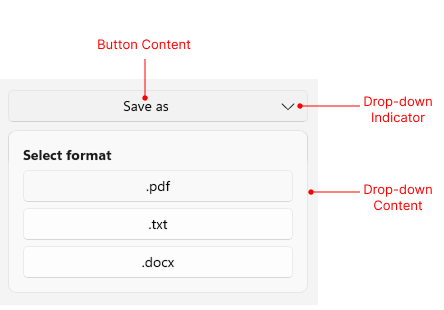

# .NET MAUI DropDownButton Visual Structure

The visual structure of the .NET MAUI DropDownButton represents the anatomy of the UI component. Being familiar with the visual elements of the DropDownButton allows you to quickly find the information required to configure them.

The following image shows the anatomy of the DropDownButton.

## Displayed Elements

* **Button Content**&mdash;The content of the DropDownButton.
* **Drop-down Content**&mdash;The content of the drop-down part of the DropDownButton.
* **Drop-down Indicator**&mdash;The indicator which function is to open or close the drop-down part of the control when clicked.

## See Also

- [Configure the Button Content and Indicator]()
- [Configure the Drop-Down Part]()
- [Style the DropDownButton]()
- [Command]()
- [Events]()
- [Animation]()
