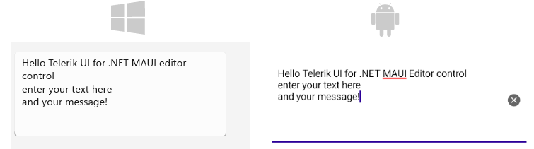
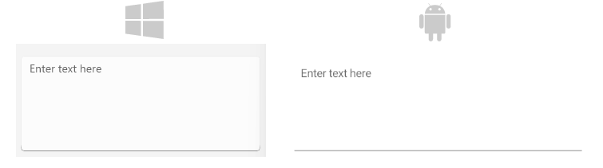

# .NET MAUI Editor Text Appearance

The Editor provides a number of settings for configuring the appearance of the text it displays such as the multiline text input itself, adding a watermark to the text, setting the Editor in its read-only state, and so on.

## Setting the Text Input

The following properties are related to the appearance and alignment of the text in the Editor control.

@[template](/_contentTemplates/controls/inputview.md#inputview-text-input)

This is the result when entering text in multi lines:



## Adding Placeholder

The Editor exposes the `Placeholder` (`string`) property that prompts users what information they are expected to enter in the text input. The placeholder text is displayed when the control is empty. Additionally, you can set the `PlaceholderColor`(`Color`) to customize the look of the watermark text as demonstrated in the following example.

```XAML
<telerikInput:RadEditor Placeholder="Enter text here"
					    PlaceholderColor="#6EA3FF" />
```

The following image shows the end result.



## Setting the Read-Only State

You can choose whether the Editor control is editable for end users by setting its read-only state through the `IsReadOnly` (`bool`) property. By default, `IsReadOnly` is set to `False`. To restrict the control from editing, set the `IsReadOnly` to `True`.

```XAML
<telerik:RadEditor x:Name="telerikEntry"
				   Text="Telerik UI for .NET MAUI Editor control"
				   IsReadOnly="True" />
```

## Defining the Max Length

You can restrict the number of the symbols the Editor control allows for its input field by using the `MaxLength` (`int`) property.

The following example demonstrates how to set the maximum length of the input to 200 symbols.

```XAML
<telerik:RadEditor x:Name="telerikEntry"
				   Placeholder="Enter text"
				   MaxLength="200" />
```

## Defining the Max Lines

The `MaxLines` (`int`) property of the `RadMultilineTextInput` allows you to set a maximum number of lines for the Editor input. By default, the `MaxLines` is set to `0`, which means that there is no limit on the number of lines.

Here is an example of how to set the `MaxLines` property at the `RadMultilineTextInput` level and using implicit style:

```XAML
<Style TargetType="telerik:RadMultilineTextInput">
    <Setter Property="MaxLines" Value="20" />
</Style>


<telerik:RadEditor />
```

## Setting Spacing Between the Characters

The `CharacterSpacing` (`double`) property allows you to define the space between the characters inside the control.

## Setting Text Prediction

`IsTextPredictionEnabled` (`bool`) property allows you to define whether text prediction and automatic text correction are on or off. The default value is `False`. 

```XAML
<telerik:RadEditor x:Name="entry"
				   IsTextPredictionEnabled="True"
				   Placeholder="Enter Text" />
```

## Setting the Keyboard Type

The `Keyboard` property of type `Microsoft.Maui.Keyboard` allows you to define the type of the keyboard that will be visualized by the device.

```XAML
<telerik:RadEditor x:Name="entry"
				   Keyboard="Numeric"
				   Placeholder="Enter Number" />
```

@[template](/_contentTemplates/controls/inputview.md#inputview-clearbutton-visibility)

## See Also

- [Text Selection]()
- [Events]()
- [Styling]()
- [Validation]()
- [Visual States]()
