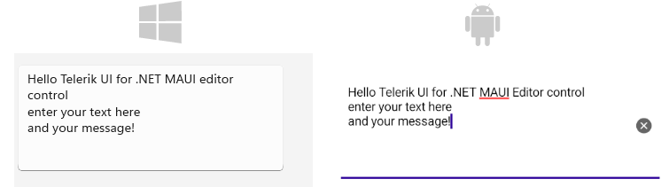
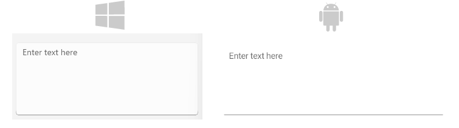

# .NET MAUI Editor Text Appearance

The Editor provides settings for configuring text appearance, placeholder text, read-only behavior, and other text-input options.

## Setting the Text Input

The following properties are related to the appearance and alignment of the text in the Editor control.

@[template](/_contentTemplates/controls/inputview.md#inputview-text-input)

This is the result when entering text in multiple lines:



## Adding Placeholder

The Editor exposes the `Placeholder` (`string`) property that prompts users what information they are expected to enter in the text input. The placeholder text is displayed when the control is empty. Additionally, you can set the `PlaceholderColor`(`Color`) to customize the look of the watermark text as demonstrated in the following example.

```XAML
<telerikInput:RadEditor Placeholder="Enter text here"
					    PlaceholderColor="#6EA3FF" />
```

The following image shows the end result.



## Setting the Read-Only State

Use the `IsReadOnly` (`bool`) property to control whether end users can edit the Editor content. By default, `IsReadOnly` equals `False`. Set `IsReadOnly` to `True` to prevent editing.

```XAML
<telerik:RadEditor x:Name="telerikEntry"
				   Text="Telerik UI for .NET MAUI Editor control"
				   IsReadOnly="True" />
```

## Defining the Max Length

You can restrict the number of the symbols the Editor control allows for its input field by using the `MaxLength` (`int`) property.

The following example demonstrates how to set the maximum length of the input to 200 symbols.

```XAML
<telerik:RadEditor x:Name="telerikEntry"
				   Placeholder="Enter text"
				   MaxLength="200" />
```

## Defining the Max Lines

Use the `MaxLines` (`int`) property to set the maximum number of lines for the Editor input. By default, `MaxLines` equals `0`, which means the Editor does not limit the number of lines.

Here is an example of how to set the `MaxLines` property:

```XAML
<telerik:RadEditor x:Name="telerikEntry"
				   Placeholder="Enter text"
				   MaxLines="10" />
```

## Configuring Auto-Size

The `AutoSize` (enum of type `EditorAutoSizeOption`) property controls whether the Editor changes its height automatically while users enter text. Automatic resizing is turned off by default.

The available options are:

* `Disabled` (Default)&mdash;The Editor keeps its current height.
* `TextChanges`&mdash;The Editor grows and shrinks according to the entered text.

```XAML
<telerik:RadEditor Placeholder="Enter text"
                   AutoSize="TextChanges"
                   MaxLines="10" />
```

## Setting Spacing Between the Characters

The `CharacterSpacing` (`double`) property allows you to define the space between the characters inside the control.

## Setting Text Prediction

The `IsTextPredictionEnabled` (`bool`) property allows you to define whether text prediction and automatic text correction are on or off. The default value is `False` (text prediction and automatic text correction are disabled).

```XAML
<telerik:RadEditor x:Name="entry"
				   IsTextPredictionEnabled="True"
				   Placeholder="Enter Text" />
```

## Setting the Keyboard Type

The `Keyboard` property of type `Microsoft.Maui.Keyboard` allows you to define the type of the keyboard that will be visualized by the device.

```XAML
<telerik:RadEditor x:Name="entry"
				   Keyboard="Numeric"
				   Placeholder="Enter Number" />
```

@[template](/_contentTemplates/controls/inputview.md#inputview-clearbutton-visibility)

## See Also

- [Text Selection]()
- [Events]()
- [Styling]()
- [Validation]()
- [Visual States]()
