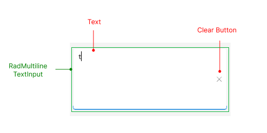

# .NET MAUI Editor Visual Structure

The visual structure of the [.NET MAUI Editor]() represents the anatomy of the UI control. Being familiar with the visual elements of the Editor allows you to quickly find the information required to configure them.

The images in this article show the anatomy of the Editor and its building blocks.

## Editor Visual Structure

- `Placeholder`&mdash;The text that guides the end-user on what can be entered/searched in the input.
- [`RadMultilineTextInput`]()&mdash;The control used for the multiline text input.

## Input Structure

- `Text`&mdash;The text entered in the control's input field.
- [`RadMultilineTextInput`]()&mdash;The control used for the multiline text input.
- `Clear Button`&mdash;Clears the selection in the control for both multiple and single selection scenarios.

## Validation Structure

- `Text`&mdash;The text entered in the control's input field.
- `Clear Button`&mdash;Clears the selection in the control for both multiple and single selection scenarios.
- `Style when IsValueValid is False`&mdash;Specifies the style applied when the value entered in the input field is invalid.
- `Invalid Image`&mdash;An image is displayed when the input value is invalid.

## See Also

- [Text Appearance]()
- [Text Selection]()
- [Events]()
- [Styling]()
- [Validation]()
- [Visual States]()