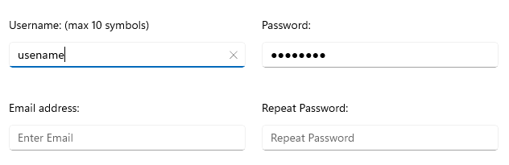

# Overview

**Telerik UI for .NET MAUI Entry** is a text input control that accepts string input and provides various customization options such as adding watermarks, setting its read-only state, defining border styles, and more.

## Key Features

* [Text appearance options]()&mdash;The Entry provides a set of options for configuring the its text input, adding a watermark to that text, setting a read-only state for the input field, defining a keyboard type, and more.
* [Text selection]()&mdash;You can specify the starting position of the selected text as well as the number of characters of the selected Entry input.
* [Styling]()&mdash;You can also customize the appearance of the border around the Entry input and set the font styles of the text.

## See Also

- [Getting Started with Telerik UI for .NET MAUI Entry]()
