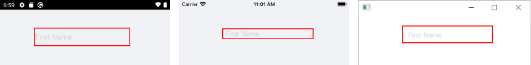

# Styling

The Entry provides styling options for setting the appearance of its border and font.

## Border Styles

The `BorderStyle` (of type `Telerik.XamarinForms.Input.BorderStyle`) property allows you to customize the border around the Entry through the following properties:

* `BorderColor`(`Color`)
* `BorderThickness`(`Thickness`)
* `CornerRadius`(`double`)

You can define the `BorderStyle` in the **Resources** of your page as shown in the example below:

```XAML
<telerikInput:BorderStyle x:Key="EntryBorderStyle"
						  BorderThickness="2"
						  BorderColor="Red" />
```

Then, apply that Style to the Entry instance:

```XAML
<telerikInput:RadEntry x:Name="entry"
					   WatermarkText="First Name"
					   BorderStyle="{StaticResource EntryBorderStyle}"/>
```

The following image shows the end result.



## Font Options

The Entry control has the following properties for defining the font options:

* `FontAttributes`
* `FontFamily`
* `FontSize`

The following example demonstrates how to apply the font options to the Entry.

```XAML
<StackLayout>
    <telerikInput:RadEntry Text="Normal Text" x:Name="entry"/>
    <telerikInput:RadEntry Text="Bold Text - Large" FontAttributes="Bold" FontSize="Large" />
    <telerikInput:RadEntry Text="Italic Text - Medium" FontAttributes="Italic" FontSize="Medium"/>
    <telerikInput:RadEntry Text="Italic and Bold Text - Small"  FontSize="Small" x:Name="smallEntry"/>
    <telerikInput:RadEntry Text="Micro Text"  FontSize="Micro" />
</StackLayout>
```

## See Also

- [Text Appearance]()
- [Text Selection]()
- [Events]()
