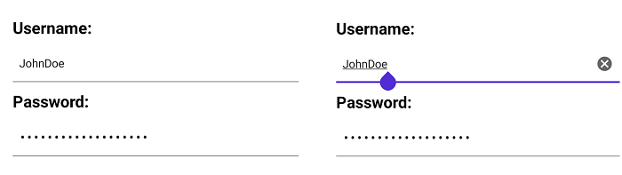

# .NET MAUI Entry Overview

The Telerik UI for .NET MAUI Entry is a text input control that accepts string input and provides various customization options such as adding watermarks, setting its read-only state, defining border styles, and more.

## Key Features

* [Placeholder](#adding-watermarks)&mdash;The Entry allows you to add a hint text as a placeholder to guide the users what is the expected input. In addition you can style the Placeholder.

* [Password functionality](#password-functionality%})&mdash;You can hide the characters that users type for privacy and security reasons.

* [Keyboard support](#setting-the-keyboard-type)&mdash;You can add a virtual keyboard and specify its type, for example, Numeric.

* [Non-editable (Read-only) state](#setting-the-read-only-state)&mdash;You can define whether users can edit the Entry or not by setting a single property.

* [Maximum number of symbols](#defining-the-max-length)&mdash;The Entry enables you to set a maximum length for its input.

* [Text selection]()&mdash;You can specify the starting position of the selected text as well as the number of characters of the selected Entry input.

* [Text prediction](#setting-text-prediction)&mdash;Define whether to have a predictive text while typing in the Entry.

* [Validation]()&mdash;If the user is entering a value not matching the requirements, the Entry will display an error message, which you can customize.

* [Clear button](#defining-the-clear-button-visibility)&mdash;Gives you the option to clear all the text entered in the Entry using a single button.

* [Commands support]()&mdash;Use the `ReturnCommand` to implement additional logic when pressing the keyboard return key. 

* [Various styling options]()&mdash;For applying corner radius, clear button color, placeholder color and more.

## Next steps

- [Getting Started with Telerik UI for .NET MAUI Entry]()

## See Also

- [.NET MAUI Entry Product Page](https://www.telerik.com/maui-ui/entry)
- [.NET MAUI Entry Forum Page](https://www.telerik.com/forums/maui?tagId=1800)
- [Telerik .NET MAUI Blogs](https://www.telerik.com/blogs/mobile-net-maui)
- [Telerik .NET MAUI Roadmap](https://www.telerik.com/support/whats-new/maui-ui/roadmap)
