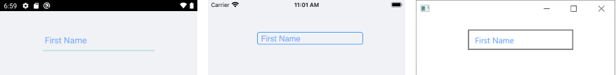

# Text Appearance

The Entry provides a number of settings for configuring the appearance of the text it displays such as the text input itself, adding a watermark to the text, setting the Entry in its read-only state, and so on.

## Setting the Text Input

The following properties are related to the Entry Text appearance and alignment:

* `Text`(`string`)&mdash;Defines the text.
* `TextColor`(`Microsoft.Maui.Graphics`)&mdash;Defines the color of the visible Entry text.
* `TextTransform`(`Microsoft.Maui.TextTransform`)&mdash;Defines the transformation of the text.
* `VerticalTextAlignment` (`Microsoft.Maui.TextAlignment`)&mdash;Specifies the vertical alignment of the text.
* `HorizontalTextAlignment` (`Microsoft.Maui.TextAlignment`)&mdash;Specifies the horizontal alignment of the text.

## Adding Placeholder

The Entry exposes the `Placeholder`(`string`) property that prompts users what kind of information they  are expected to enter in the text input. The placeholder text is displayed when the control is empty.  Additionally, you can set the `PlaceholderColor`(`Color`) to customize the look of the watermark text as demonstrated in the following example.

```XAML
<telerikInput:RadEntry Placeholder="First Name"
					   PlaceholderColor="#6EA3FF" />
```

In the provided example:

```XAML
xmlns:telerik="http://schemas.telerik.com/2022/xaml/maui"
```

The following image shows the end result.



## Password functionality

The Telerik .NET MAUI Entry provides `IsPassword`(`bool`) property, which when set to `True`, replaces the input with password hint character. The default value is `False`.

```XAML
<telerik:RadEntry Placeholder="Enter password"
                  IsPassword="True">
</telerik:RadEntry>
```

## Setting the Read-Only State

You can choose whether the Entry control is editable for end users or not by setting its read-only state through the `IsReadOnly` `bool` property. By default, `IsReadOnly` is set to `False`. To restrict the control from editing, set the `IsReadOnly` to `True`.

```XAML
<telerik:RadEntry x:Name="telerikEntry"
				  Text="Telerik UI for .NET MAUI Entry control"
				  IsReadOnly="True" />
```

## Defining the Max Length

You can restrict the number of the symbols the Entry control allows for its input field by using the `MaxLength` (`int`) property.

The following example demonstrates how to set the maximum length of the input to 10 symbols.

```XAML
<telerik:RadEntry x:Name="telerikEntry"
				  Placeholder="Enter text"
				  MaxLength="10" />
```

## Setting spacing between the characters

The `CharacterSpacing`(`double`)property allows you to define the space between the characters inside the control.

## Setting Text Prediction

* `IsTextPredictionEnabled`(`bool`)property allows you to define whether text prediction and automatic text correction is on or off. The default value is false. 

```XAML
<telerik:RadEntry x:Name="entry"
				  IsTextPredictionEnabled="True"
				  Placeholder="Enter Text" />
```

## Setting the Keyboard Type

The `Keyboard` property of type `Microsoft.Maui.Keyboard` allows you to define the type of the keyboard that will be visualized by the device.

```XAML
<telerik:RadEntry x:Name="entry"
				  Keyboard="Numeric"
				  Placeholder="Enter Text" />
```

## Setting the Return Type

Easily change the keyboard **return key type** using the `ReturnType`(`Microsoft.Maui.ReturnType`) property. The available options are `Default`,`Done`,`Go`,`Next`,`Search` and `Send`. The default return type is `Default`.

```XAML
<telerik:RadEntry Placeholder="Enter your idea" 
                  ReturnType="Send">
</telerik:RadEntry>
```

## Defining the Clear Button visibility

The `ClearButtonVisibility`(`Microsoft.Maui.ClearButtonVisibility`) indicates when the clear-button (the button that clears the text when pressed) should be displayed. The default value is `WhileEditing`. 
If you want to hide the clear button while entering text inside the control, then set the `ClearButtonVisibility` to `Never`.

## See Also

- [Text Selection]()
- [Events]()
- [Styling]()
