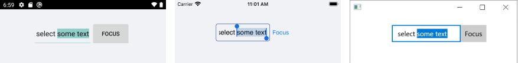

# Text Selection

The Entry supports a number of settings for managing the selection of its input text.

The text selection properties provided by the Entry are:

* `CursorPosition`(`int`)&mdash;Specifies the starting position of the selected text in the entry.

* `SelectionLength`(`int`)&mdash;Specifies the number of characters in the current Entry selection.

The following snippet shows how to preselect a part of the Entry text when the control is focused by applying both properties.

Define the text orientation and the text of the Entry.

```XAML
<HorizontalStackLayout>
    <telerik:RadEntry x:Name="selectEntry"
					  Text="select some text" />
    <telerik:RadButton Text="Focus"
				       Clicked="FocusButtonClicked" />
</HorizontalStackLayout>
```

Set the `Clicked` event handler:

```C#
private void FocusButtonClicked(object sender, System.EventArgs e)
{
    selectEntry.Focus();
    selectEntry.CursorPosition = 7;
    selectEntry.SelectionLength = 9;
}
```

The following image shows the end result.



## See Also

- [Events]()
- [Styling]()
