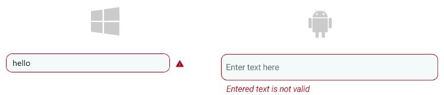

# .NET MAUI Entry Validation

The Telerik UI for .NET MAUI entry control provides validation mechanism. If the user is entering a value not matching the requirements, the Entry will display an error message, which you can easily customize.

* `IsValueValid`(`bool`)&mdash;Specifies whether the Text entered inside the control is valid. The default value is true.

* `ValidationErrorMessage`(`string`)&mdash;Specifies the the error message which is displayed when the text entered inside the control is not valid.


```XAML
<telerik:RadEntry ValidationErrorMessage="Value is not valid"
				  IsValueValid="False"
				  Placeholder="Enter text here"
				  PlaceholderColor="#99000000">
</telerik:RadEntry>
```

And the namespace used:

```XAML
xmlns:telerik="http://schemas.telerik.com/2022/xaml/maui"
```

* The Entry control in MacCatalyst is preserving space on its right side for the error icon. If developers are not using the validation feature of the Entry, there is an API that makes the control takes its entire space - the `ReserveSpaceForErrorView`(`bool`) property. The default value is `true`.
The image below shows the error icon that is displayed inside the reserved space:



## See Also

- [Text Appearance]()
- [Text Selection]()
- [Events]()
