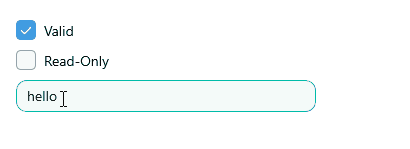

# .NET MAUI Entry Visual States

This article describes the visual states provided by the Entry control. You can use these visual states to change the appearance of the control based on its state—such as when it’s disabled, focused, hovered, and more.

The Entry provides the following `CommonStates` visual states:

@[template](/_contentTemplates/controls/inputview.md#inputview-visual-states)

## Using the Visual States

The following example demonstrates how to use the Entry's Visual States.

**1.** Define the Entry in XAML:

<snippet id='entry-style' />

**2.** Define the Entry's style in the page's resources:

<snippet id='entry-styling' />

**3.** Define the clear button style in the page's resources:

<snippet id='entry-styling-clear-button' />

**4.** Define the validation error label style in the page's resources:

<snippet id='entry-styling-validation-error-label' />

**5.** Define the validation error image style in the page's resources:

<snippet id='entry-styling-validation-error-image' />

**6.** Add the `telerik` namespace:

```XAML
xmlns:telerik="http://schemas.telerik.com/2022/xaml/maui"
```

This is the result on WinUI: 



>tip For a runnable example demonstrating the Entry's Visual States, see the [SDKBrowser Demo Application]() and go to the **Entry > Styling** category.

## See Also

- [Entry Styling]()
- [Apply Implicit Style]()
- [Styling Entry Using Visual States]()
