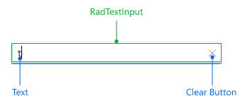

# .NET MAUI Entry Visual Structure

Here are described all visual elements used in the [.NET MAUI Entry]().

## Entry Visual Structure

### Input

### Validation

## Legend

- `Placeholder`&mdash;The text which is used to give guidance to the end user on what can be entered/searched in the input.
- `Text`&mdash;The text written in the control's input filed.
- [`RadTextInput`]()&mdash;The control used for the text input
- `Clear Button`&mdash;Clears the selection of the control both multiple and single.
- `Style when IsValueValis is False`&mdash;Specifies the style when entering an invalid value inside the input field.
- `Invalid Image`&mdash;An image is displayed when the input value is invalid.

