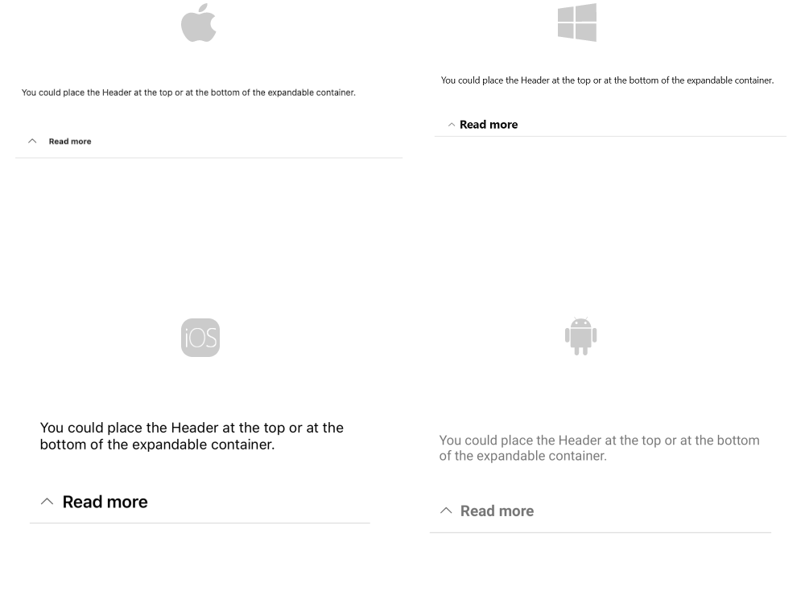

# Getting Started with .NET MAUI Expander

This article will guide you through the steps needed to add a basic `RadExpander` control in your application.

At the end, you will be able to achieve the following result.



## Prerequisites

Before adding the BadgeView, you need to:

1. [Set up your .NET MAUI application](#step-1-set-up-your-net-maui-application).

1. [Download Telerik UI for .NET MAUI](#step-2-download-telerik-ui-for-net-maui).

1. [Install Telerik UI for .NET MAUI](#step-3-install-telerik-ui-for-net-maui).

## Define the Control

The snippet below shows a simple `RadExpander` definition in XAML:

<snippet id='expander-getting-started-xaml' />

In order to use the control in XAML, you need to add the following namespace:

```XAML
xmlns:telerik="http://schemas.telerik.com/2022/xaml/maui"
```

The snippet below shows a simple `RadExpander` definition in C#:
<snippet id='expander-gettingstarted-csharp' />

In order to use the control in C#, you need to add the following namespace:

```C#
using Telerik.Maui.Controls;
```

Register the Telerik controls through the `Telerik.Maui.Controls.Compatibility.UseTelerik` extension method called inside the `CreateMauiApp` method of the `MauiProgram.cs` file of your project:


```C#
 using Telerik.Maui.Controls.Compatibility;

 public static class MauiProgram
 {
	public static MauiApp CreateMauiApp()
	{
		var builder = MauiApp.CreateBuilder();
		builder
			.UseTelerik()
			.UseMauiApp<App>()
			.ConfigureFonts(fonts =>
			{
				fonts.AddFont("OpenSans-Regular.ttf", "OpenSansRegular");
			});

		return builder.Build();
	}
 }           
```

## Additional Resources

- [.NET MAUI Expander product page](https://www.telerik.com/maui-ui/expander)
- [.NET MAUI Expander forum page](https://www.telerik.com/forums/maui?tagId=1980)
- [Telerik .NET MAUI blogs](https://www.telerik.com/blogs/mobile-net-maui)
- [Telerik .NET MAUI roadmap](https://www.telerik.com/support/whats-new/maui-ui/roadmap)

## See Also

- [Configuration]()