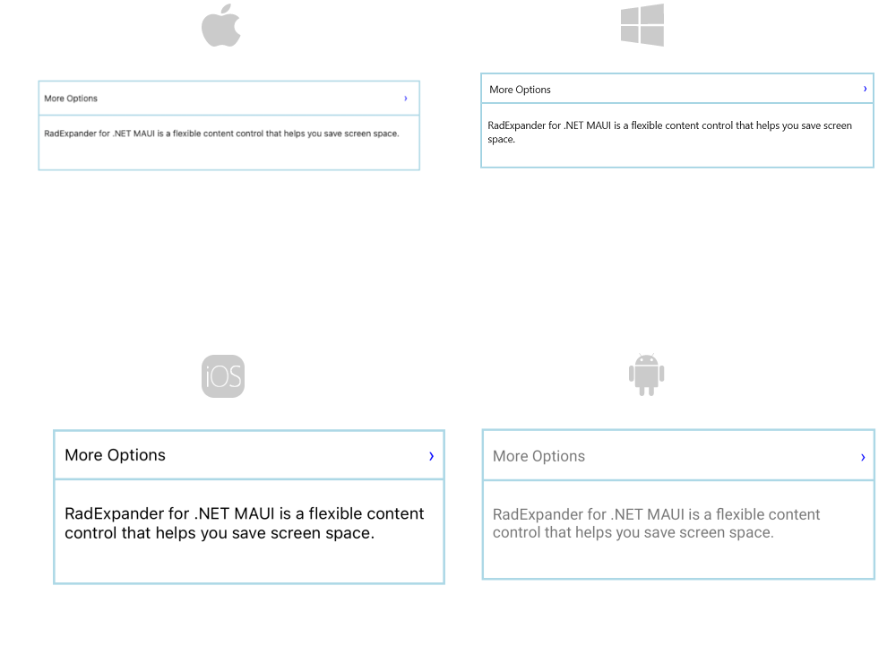

# .NET MAUI Expander Header Control

The `ExpanderHeader` class represents the Header of the Expander control and is used to show or hide the expandable container. The `ExpanderHeader` provides a customizable Indicator to mark the current state of the Expander as well as `BorderColor` and `BorderThickness` properties to style the Header.

## Indicator Options

The indicator is the triangle that is rotated according to whether the Expander control is expanded or collapsed. The `ExpanderHeader` provides various options for customizing the look of the indicator through the following properties:

* `IndicatorText`&mdash;The indicator is represented by a string symbol that can be changed through `IndicatorText` property;
* `IndicatorFontFamily`&mdash;Specifies the indicator text `FontFamily`;
* `IndicatorFontSize`&mdash;Defines the indicator text font size;
* `IndicatorColor`&mdash;This property sets the color of the indicator;
* `IndicatorLocation`&mdash;This property is of type `ExpandCollapseIndicatorLocation` and is used to place the indicator to the left or to the right inside the Header;
* `IndicatorAnimationDuration`&mdash;Specifies the duration of the rotation animation of the indicator;
* `IndicatorAnimationEasing`&mdash;Specifies the easing of the rotation animation of the indicator;
* `IndicatorMargin`&mdash;This property is of type `Thickness` and sets the margin applied to the indicator;

Here is an example how to style the Indicator:

<snippet id='expander-features-indicator-style'/>

## Border styling

You can apply `BorderColor` and `BorderThickness` properties of the `ExpanderHeader` to make it compatible with the design of your app. 

## Example

Check the example below on how the Indicator options and border properties can be applied:

<snippet id='expander-features-expanderheader'/>

And the final result:

> For a runnable example with the Expander Header scenario, see the [SDKBrowser Demo Application]() and go to **Expander > Features** category.

## See Also

- [Configuration]()
