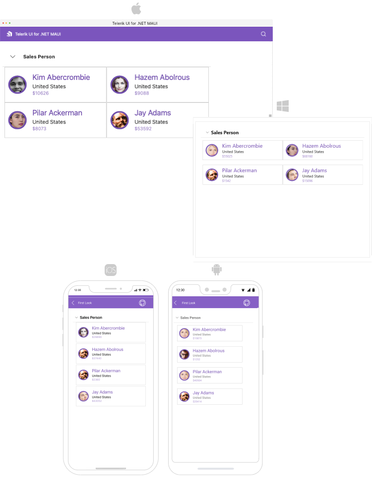

# .NET MAUI Expander Overview

The Telerik UI for .NET MAUI Expander helps you save screen space by presenting content in an expandable container that can be expanded/collapsed by tapping on the header of the control.

## .NET MAUI Expander Key Features

* [Collapsed/expanded states]()&mdash;Expander provides an expandable area which can hold content of your choice. The end users can show or hide this content by interacting with the Header of the control.
* [Customizable Header]()&mdash;You have full control over the visual appearance of the Header of the control.
* [Animation](#animation-while-expanding-or-collapsing) while expanding/collapsing&mdash;Expander provides slick customizable animation played while the expandable content is expanded/collapsed.
* [Styling](#border-styling)&mdash;You can apply various Border color and thickness of Expander to make it compatible with the design of your app.

## Next Steps

- [Getting Started with Telerik UI for .NET MAUI Expander]()

## See Also

- [.NET MAUI Expander Product Page](https://www.telerik.com/maui-ui/expander)
- [.NET MAUI Expander Forum Page](https://www.telerik.com/forums/maui?tagId=1980)
- [Telerik .NET MAUI Blogs](https://www.telerik.com/blogs/mobile-net-maui)
- [Telerik .NET MAUI Roadmap](https://www.telerik.com/support/whats-new/maui-ui/roadmap)
