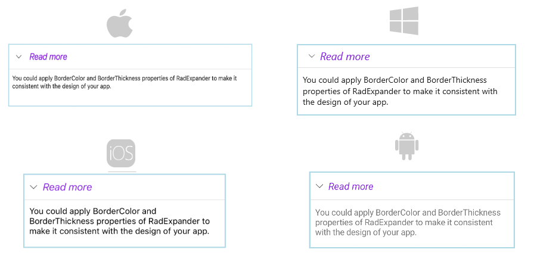

# .NET MAUI Expander Styling

The purpose of this help article is to show you how to style the Telerik .NET MAUI Expander control. 

## Border Styling

You can apply the `BorderColor` and `BorderThickness` properties of the `RadExpander` to make it match your app's design.

>note `ExpanderHeader` also provides means for customizing its border, you can learn more about this in the [`ExpanderHeader`: Border Styling](#border-styling) article.

Check the example below on how the border settings can be defined:

<snippet id='expander-features-borderstyling'/>

> For a runnable example with the Expander Styling scenario, see the [SDKBrowser Demo Application]() and go to **Expander > Features** category.

## Header Styling

To style the header of the Expander control, use the `HeaderStyle` property (of type `Style` with target type `Telerik.Maui.Controls.ExpanderHeader`).

The following code shows how to declare the `HeaderStyle` property in the Expander:

<snippet id='expander-features-header-style'/>

This is the result:

> For a runnable example with the Expander Styling scenario, see the [SDKBrowser Demo Application]() and go to **Expander > Features** category.

## Header Text Styling

To customize the text inside the header, use the `HeaderTextStyle` property (`Style` with target type `Label`). If `HeaderTextStyle` is not set, the text inside is bold by default.

The following code shows how to declare the `HeaderTextStyle` property in the Expander:

<snippet id='expander-features-headertext-styling'/>

This is the result:

> For a runnable example with the Expander Styling scenario, see the [SDKBrowser Demo Application]() and go to **Expander > Features** category.

## See Also

- [Getting Started]()
