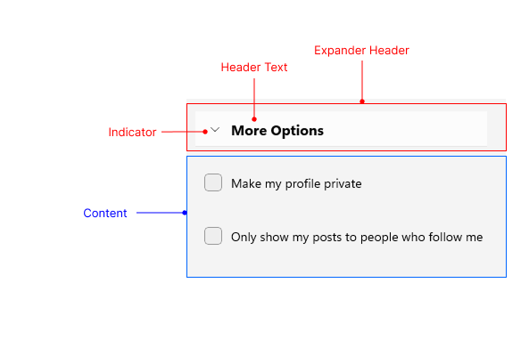

# .NET MAUI Expander Visual Structure

The visual structure of the .NET MAUI Expander represents the anatomy of the UI component. Being familiar with the visual elements of the Expander allows you to quickly find the information required to configure them.

The following image shows the anatomy of the Expander.

## Displayed Elements

* **Expander Header**&mdash;The header area of the Expander that is always visible and can be tapped to expand or collapse the content. The header contains the **Indicator** and the **Header Text**.
* **Header Text**&mdash;The text displayed in the Expander header.
* **Indicator**&mdash;The arrow icon that indicates whether the Expander is expanded or collapsed.
* **Content**&mdash;The area that displays additional information when the Expander is expanded.
## See Also

* [Getting Started]()
* [Expander Styling]()
* [Expander Configuration]()
