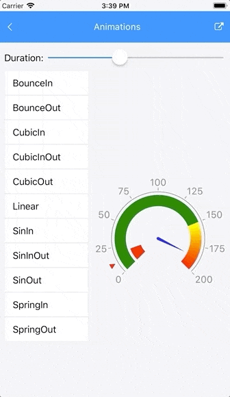

# .NET MAUI Gauge Animations

All Gauge indicators are animated upon initial load and upon value change. The animations are enabled by default.

To control the Gauge animations, use the `AnimationSettings` property by applying it either to the Gauge or separately to its indicators. By default, the property of the indicator is `null` and in this case the `AnimationSettings` property of the Gauge will be considered. This behavior allows you to control all animations by setting a single property, that of the Gauge. To animate an indicator differently, set its `AnimationSettings` property as it has a higher precedence than the Gauge property.

The `AnimationSettings` class contains the following properties:

* `Duration` (`int`)&mdash;Defines the duration of the animation in milliseconds.
* `Easing`&mdash;Defines the easing of the animation.
* `Enabled` (`bool`)&mdash;Specifies whether the animation will be enabled or not. By default, the `Enabled` property is `true`.

The following example demonstrates how to set the `AnimationSettings` property:

```XAML
<telerik:RadRadialGauge x:Name="gauge1"
					    Grid.Row="1"
					    Grid.Column="1">
    <telerik:RadRadialGauge.AnimationSettings>
        <telerik:AnimationSettings x:Name="gauge1Animations" Easing="{Static Easing.CubicOut}" />
    </telerik:RadRadialGauge.AnimationSettings>
    <telerik:RadRadialGauge.Axis>
        <telerik:GaugeLinearAxis Maximum="200"
							     Minimum="0"
							     Step="25" />
    </telerik:RadRadialGauge.Axis>
    <telerik:RadRadialGauge.Indicators>
        <telerik:GaugeShapeIndicator Value="80" />
        <telerik:GaugeBarIndicator Offset="30" Value="100" />
        <telerik:GaugeNeedleIndicator Fill="Blue"
									  Offset="30"
									  Value="120" />
    </telerik:RadRadialGauge.Indicators>
    <telerik:RadRadialGauge.Ranges>
        <telerik:GaugeRangesDefinition>
            <telerik:GaugeRange Color="Green"
							    From="0"
							    To="150" />
            <telerik:GaugeGradientRange From="150" To="200">
                <telerik:RadGradientStop Offset="150" Color="Yellow" />
                <telerik:RadGradientStop Offset="200" Color="Red" />
            </telerik:GaugeGradientRange>
        </telerik:GaugeRangesDefinition>
    </telerik:RadRadialGauge.Ranges>
</telerik:RadRadialGauge>
```

The following GIF animation shows all animations supported by the Gauge.



## See Also

- [Indicators]()
- [Positioning]()
- [Ranges]()
