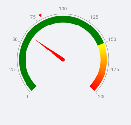

# Getting Started

This guide provides the information you need to start using the Telerik UI for .NET MAUI Gauge by adding the control to your project.

At the end, you will be able to achieve the following result.



## Prerequisites

Before adding the Gauge, you need to:

1. [Set up your .NET MAUI application](#set-up-your-net-maui-application).

1. [Download Telerik UI for .NET MAUI](#download-telerik-ui-for-net-maui).

1. [Install Telerik UI for .NET MAUI](#install-telerik-ui-for-net-maui).

>important The Gauge is rendered through the [SkiaSharp graphics library](https://skia.org/).

## Define the Control

1. When the your .NET MAUI application is set up, you are ready to add a Gauge control to your page.

 <snippet id='gauge-getting-started-xaml'/>

1. Add the following namespace:

 ```XAML
xmlns:telerik="http://schemas.telerik.com/2022/xaml/maui"
 ```

1. Register the Telerik controls through the `Telerik.Maui.Controls.Compatibility.UseTelerik` extension method called inside the `CreateMauiApp` method of the `MauiProgram.cs` file of your project:

```C#
 using Telerik.Maui.Controls.Compatibility;

 public static class MauiProgram
 {
	public static MauiApp CreateMauiApp()
	{
		var builder = MauiApp.CreateBuilder();
		builder
			.UseTelerik()
			.UseMauiApp<App>()
			.ConfigureFonts(fonts =>
			{
				fonts.AddFont("OpenSans-Regular.ttf", "OpenSansRegular");
			});

		return builder.Build();
	}
 }           
```

## Additional Resources

- [.NET MAUI Gauge product page](https://www.telerik.com/maui-ui/gauge)
- [.NET MAUI Gauge forum page](https://www.telerik.com/forums/maui?tagId=1781)
- [Telerik .NET MAUI blogs](https://www.telerik.com/blogs/tag/.net-maui)
- [Telerik .NET MAUI roadmap](https://www.telerik.com/support/whats-new/maui-ui/roadmap)

## See Also

- [Radial Gauge]()
- [Horizontal Gauge]()
- [Vertical Gauge]()
