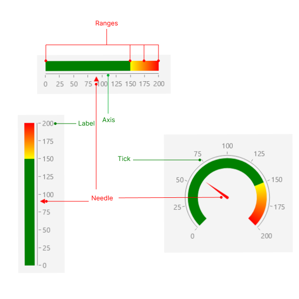

# .NET MAUI Gauge Visual Structure

The visual structure of the .NET MAUI Gauge represents the anatomy of the UI component. Being familiar with the visual elements of the Gauge allows you to quickly find the information required to configure them.

The following image shows the anatomy of the Gauge.

## Displayed Elements

* **Axis**&mdash;The axis represents a scale with ticks and labels that indicate the values of the gauge.
* **Label**&mdash;The values on the axis are represented by labels.
* **Tick**&mdash;The ticks on the axis indicate specific values on the scale.
* **Needle**&mdash;The needle is a pointer that indicates to a specific value on the gauge.
* **Ranges**&mdash;The Gauge ranges provide context to the indicated value or values. The ranges denote some parts of the axis range and are usually displayed with different colors to provide additional information.

## See Also

* [Getting Started]()
* [Gauge Indicators]()
* [Gauge Axis]()
* [Gauge Ranges]()
