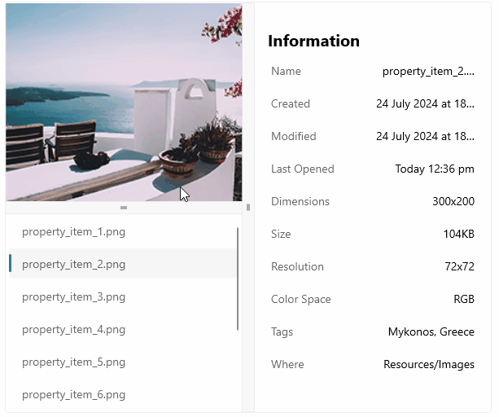

# .NET MAUI GridSplitter Overview

The Telerik UI for .NET MAUI GridSplitter is a control, which allows the redistribution of space between columns or rows in a Grid. By dragging the splitter, users can resize the target columns or rows to better fit the content.

The GridSplitter control automatically detects the target columns or rows to resize. As you drag the control, it begins resizing and redistributing space between them. You can specify whether the GridSplitter resizes rows or columns, as well as which columns or rows are adjusted relative to the GridSplitter's defined position.

You can define the GridSplitter to be located within its own row (for horizontal GridSPlitter) or column (for a vertical GridSplitter). You can also place the GridsPlitter control to the following positions:
* In a cell with another control.
* As a last element in the Grid, in order to position the GridSplitter on top of the control that the GridSplitter shares a cell with.

## Key Features of the .NET MAUI GridSplitter

* [Resize behavior](#resize-behavior)&mdash;The GridSplitter allows you to control which columns or rows are resized relative to the position of the splitter.
* [Resize direction](#resize-direction)&mdash;You can control whether the GridSplitter control resizes rows or columns. 
* [Visual states](#visual-states)&mdash;You can use visual states to change the appearance of the control based on its state&mdash;for example, when it's disabled or hovered.
* [Styling API]()&mdash;The GridSplitter exposes a set of styling properties for customizing its visual appearance and enables you to set its background, border, and gripper color.

## Next Steps

- [Getting Started with Telerik UI for .NET MAUI GridSplitter]()

## See Also

- [.NET MAUI GridSplitter Product Page](https://www.telerik.com/maui-ui/gridsplitter)
- [.NET MAUI GridSplitter Forum Page](https://www.telerik.com/forums/maui?tagId=1784)
- [Telerik .NET MAUI Blogs](https://www.telerik.com/blogs/mobile-net-maui)
- [Telerik .NET MAUI Roadmap](https://www.telerik.com/support/whats-new/maui-ui/roadmap)