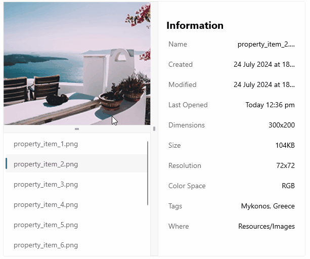

# .NET MAUI GridSplitter Overview

The Telerik UI for .NET MAUI GridSplitter lets users resize rows or columns in a `Grid` layout by dragging a splitter. This is useful when you want the layout to adapt to different content sizes or when you want users to control how much space each region receives.

The GridSplitter automatically detects the target rows or columns that it should resize based on its position in the `Grid`. You can also control whether it resizes rows or columns and which neighboring definitions it adjusts while the user drags it.

## When Should You Use a GridSplitter

Use a GridSplitter when you want to:

- Let users resize panels, content areas, or navigation regions in a `Grid`.
- Adjust the space between columns or rows without rebuilding the layout.
- Support dashboard, master-detail, or side-by-side content layouts that benefit from manual resizing.

## How Does GridSplitter Placement Work

You can place the GridSplitter in different ways depending on the layout you want:

- Put it in its own row when the splitter resizes rows.
- Put it in its own column when the splitter resizes columns.
- Place it in the same cell as another control when you want the splitter to share space with existing content.
- Add it as the last element in the `Grid` when you want it to appear on top of another control in the same cell.

In most layouts, a horizontal GridSplitter resizes rows and a vertical GridSplitter resizes columns.

## What Can You Configure in the GridSplitter

You can configure the GridSplitter to control:

- The resize direction, so it resizes either rows or columns.
- The resize behavior, so it determines which neighboring rows or columns are affected.
- The visual appearance, including the background, border, gripper color, and visual states.

## Key Features of the .NET MAUI GridSplitter

Use the following articles to go deeper into the main GridSplitter capabilities:

- [Resize behavior](#resize-behavior)&mdash;Controls which columns or rows are resized relative to the splitter position.
- [Resize direction](#resize-direction)&mdash;Controls whether the GridSplitter resizes rows or columns.
- [Visual states](#visual-states)&mdash;Changes the appearance of the control based on its state, for example when it is disabled or hovered.
- [Styling API]()&mdash;Customizes the background, border, gripper color, and other visual properties.

## Next Steps

Use the following resources to continue:

- [Get started with the Telerik UI for .NET MAUI GridSplitter]()
- [Configure GridSplitter resize behavior and direction]()
- [Style the Telerik UI for .NET MAUI GridSplitter]()

## See Also

- [.NET MAUI GridSplitter Product Page](https://www.telerik.com/maui-ui/gridsplitter)
- [.NET MAUI GridSplitter Forum Page](https://www.telerik.com/forums/maui?tagId=1784)
- [Telerik .NET MAUI Blogs](https://www.telerik.com/blogs/mobile-net-maui)
- [Telerik .NET MAUI Roadmap](https://www.telerik.com/support/whats-new/maui-ui/roadmap)