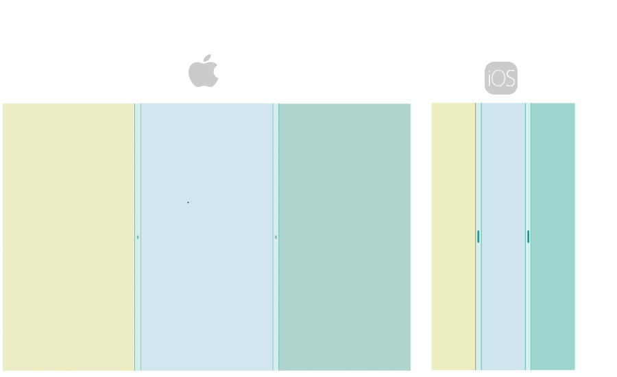

# .NET MAUI GridSplitter Styling

The GridSplitter control offers a range of styling options, allowing you to customize its appearance and adjust its visual states for different user interactions.

The GridSplitter allows you to customize its look using the following properties:

* `BackgroundColor` (`Color`)&mdash;Specifies the background color of the control.
* `Background` (`Brush`)&mdash;Specifies the background brush of the control.
* `BorderColor` (`Color`)&mdash;Specifies the border color of the control.
* `BorderBrush` (`Brush`)&mdash;Specifies the border brush of the control.
* `BorderThickness` (`Thickness`)&mdash;Specifies the border thickness of the control.
* `CornerRadius` (`Thickness`)&mdash;Specifies the border corner radius of the control.
* `ContentPadding` (`Thickness`)&mdash;Specifies the padding of the content in the control.

In addition, you can style the gripper by using the `GripperColor` (`Color`) property.

## Visual States

You can use visual states to change the appearance of the control based on its state, for example, when it's disabled and hovered.

The GridSplitter provides the following CommonStates visual states:

* `Normal`&mdash;Applies when the GridSplitter is in normal state.
* `MouseOver`&mdash;Applies when the mouse pointer is over the GridSplitter.
* `Disabled`&mdash;Applies when the GridSplitter visual state is set to disabled.

This is the result of applying the visual states:


## Example

Here is an example of how to style the GridSplitter control and use the visual states.

**1** Define the GridSplitter in XAML.

<snippet id='gridsplitter-gripper-styling' />

**2.** Add the `telerik` namespace:

```XAML
 xmlns:telerik="http://schemas.telerik.com/2022/xaml/maui"
```

This is the result:



> For a runnable example with the GridSplitter Styling and visual states scenario, see the [SDKBrowser Demo Application]() and go to **GridSplitter > Features** category.

## See Also

- [Configure the GridSplitter]()