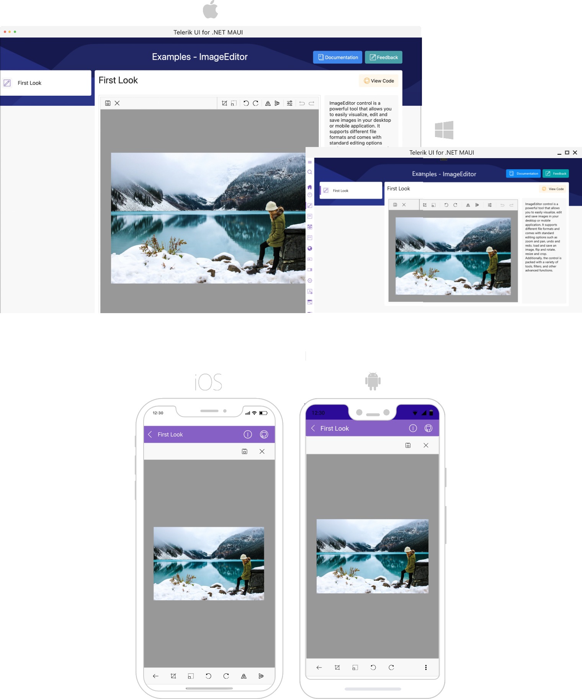

# .NET MAUI ImageEditor Overview

**Telerik .NET MAUI ImageEditor** is a control that enables you to easily visualize and edit images in different file formats in your mobile and desktop application. As an addition to the ImageEditor control you can use the predefined UI wil all built-in commands - RadImageEditorToolbar. This UI includes all editing capabilities of the control and it could be easily customized.

## Key features

* Importing and Exporting images&mdash;ImageEditor allows you to import different image formats such as **JPEG, PNG, GIF, BMP** and export images in **JPEG, PNG** format.
* [Various image source options]()&mdash;Load images from a Stream, File (as embedded resource, or image located on the device) and URI.
* **Rich image editing features set**: The control comes with a various editing capabilities: 
	* **Image Transformations**
		* **Crop**
		* **Resize**
		* **Rotate**, etc.
	
	* **Effects**
		* **Hue**
		* **Saturation**
		* **Brightness**
		* **Contrast** and many more.
* [Save the image]()in a different format, size, quality and more.
* **Support for undo/redo**&mdash;ImageEditor has a history stack with the changes applied to the image. This means that you can reverse and re-apply actions.
* **Support for Interactive Pan and Zoom**&mdash;ImageEditor provides pan and zoom functionality that will help you interact with the image and display it in a convenient way.
* **Built-in Toolbar**&mdash;You could take advantage of a pre-defined UI automatically wired with all toolbar items provided by the control through built-in functionality.
* **Custom Toolbar**&mdash;The ImageEditor Toolbar can be fully customized. You could populate the toolbar with the ToolbarItems needed for editing the image.
* [Commands support]()&mdash;The control provides built in commands and interactive commands. In addition there are Toolbar commands.

## Next steps

- [Getting Started with Telerik UI for .NET MAUI ImageEditor]()

## See Also

- [.NET ImageEditor page](https://www.telerik.com/maui-ui/imageeditor)
- [.NET MAUI ImageEditor forum page](https://www.telerik.com/forums/maui?tagId=1781)
- [Telerik .NET MAUI blogs](https://www.telerik.com/blogs/mobile-net-maui)
- [Telerik .NET MAUI roadmap](https://www.telerik.com/support/whats-new/maui-ui/roadmap)
