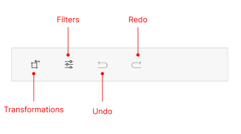
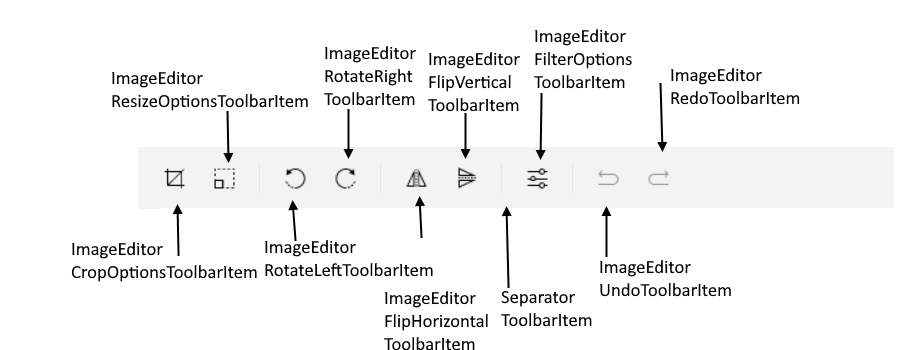

# .NET MAUI ImageEditor Toolbar Items

This article explains all available toolbar items in the ImageEditor for .NET MAUI.

## Built-in Toolbar Items for Image Editing

The built-in toolbar items are described in the tables below:

### Toolbar Items Available on Mobile - Android and iOS

The table below shows the built-in toolbar items available for mobile -  Android and iOS:

| Toolbar Item | Description |
| ------------ | ------- |
| `ImageEditorTransformationsToolbarItem` | Common toolbar item that includes all available transformation options like crop, resize, rotate(left and right) and flip(horizontal and vertical) |
| `ImageEditorFiltersToolbarItem` | Common toolbar item that includes all available filter toolbar items: blur, sharpen, contrast, hue, saturation, brightness |
| `ImageEditorUndoToolbarItem` | Undoes the last executed action on the image in the ImageEditor |
| `ImageEditorRedoToolbarItem` | Redoes the last executed action on the image in the ImageEditor |

### Toolbar Items Available on Desktop - WinUI and MacCatalyst

The table below shows the built-in toolbar items available for desktop - `WinUI` and `MacCatalyst`:

| Toolbar Item | Description |
| ------------ | ------- |
| `ImageEditorCropOptionsToolbarItem` | Represents a button displaying a crop options panel |
| `ImageEditorResizeOptionsToolbarItem` | Represents a button displaying a resize options panel |
| `ImageEditorRotateLeftToolbarItem` | Rotates the image 90 degrees to the left |
| `ImageEditorRotateRightToolbarItem` | Rotates the image 90 degrees to the right |
| `ImageEditorFlipHorizontalToolbarItem` | Flips the image in horizontal direction |
| `ImageEditorFlipVerticalToolbarItem` | Flips the image in vertical direction |
| `ImageEditorFilterOptionsToolbarItem` | Represents a button displaying a filter options panel for applying filters like blur, hue, saturation, etc. |
| `ImageEditorUndoToolbarItem` | Undoes the last executed action on the image in the ImageEditor |
| `ImageEditorRedoToolbarItem` | Redoes the last executed action on the image in the ImageEditor |
| `SeparatorToolbarItem` | Represents a separator between the toolbar items |

## Toolbar Configuration

`RadImageEditorToolbar` inherits from the `RadToolbar`(). All properties for configuration and styling available for the `RadToolbar` applies to the `RadImageEditorToolbar`.

## Toolbar Item Configuration 

Review all properties available for toolbar items configuration.

### Properties for All Toolbar Items**

The properties described bellow apply to all toolbar items available in the `ImageEditorToolbar`:

* `ControlTemplate`(`Microsoft.Maui.Controls.ControlTemplate` with target type `Telerik.Maui.Controls.ToolbarItem`)&mdash;Specifies the control template of the toolbar item.
* `IsEnabled`(`bool`)&mdash;Specifies whether the toolbar item is enabled.
* `IsVisible`(`bool`)&mdash;Specifies whether the toolbar item is visible.
* `PlacementOptions`(enum of type `Telerik.Maui.Controls.ToolbarItemPlacementOptions`)&mdash;Defines the allowed placement options of the toolbar item in the toolbar. The available options are:
	* `ToolStrip`&mdash;The toolbar item appears in the main tool strip area of the toolbar.
	* `DropDown`&mdash;The toolbar item appears in the overflow drop-down menu of the toolbar.

### Properties for Specific Toolbar Items**

The properties described below apply to `blur`, `hue`, `saturation`, `brightness`, `sharpen`, `contrast`, `flip`, `resize`, `undo`, `redo`, `crop`, `rotate`, `button` toolbar items:

* `Text`(`string`)&mdash;Specifies the text in the toolbar item.
* `ImageSource`(`Microsoft.Maui.Controls.ImageSource`)&mdash;Specifies the source of the image to display in the toolbar item.
* `Style`(`Microsoft.Maui.Controls.Style` with target type `Telerik.Maui.Controls.ToolbarItemView`)&mdash;Specifies the style applied to the toolbar item.
* `Command`(`ICommand`)&mdash;Defines the command that is executed when the button is clicked.
* `CommandParameter`(`object`)&mdash;Defines the parameter of the command, which is executed when the button is clicked.
* `Clicked` event&mdash;Raised when the button is clicked.

### Properties for Filter Toolbar Items - `blur`, `hue`, `saturation`, `brightness`, `sharpen`, `contrast`**

* `Value`(`double`)&mdash;Defines the current value, when using an auto-generated slider content. Default value is`0`.
* `MinimumProperty`(`double`)&mdash;Defines the minimum value, when using an auto-generated slider content. Default value is `-100`.
* `MaximumProperty`(`double`)&mdash;Defines the maximum value, when using an auto-generated slider content. Default value is `100`.

### Properties for Navigation Toolbar Item**

* `AutoGenerateItems`(`bool`)&mdash;Specifies a value indicating whether to auto-generate all child items by default. The default value is `true`.
* `Items`(`IList<ToolbarItem>`)&mdash;Read-only collection of `Telerik.Maui.Controls.ToolbarItems`.

 >important For the ImageEditorToolbar example review the ImageEditor Getting Started example in the [SDKBrowser Demo Application]().

## See Also

- [Saving Images]()
- [Loading Images]()
- [Zooming Images]()
