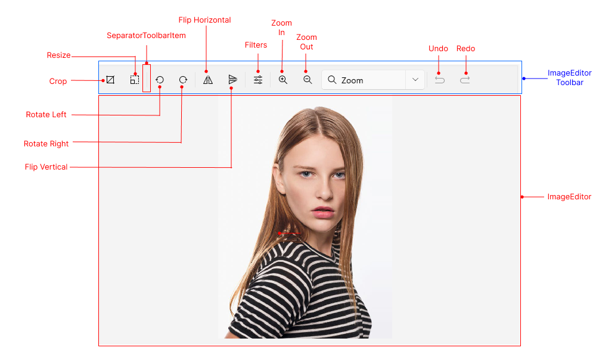

# .NET MAUI ImageEditor Visual Structure

The visual structure of the .NET MAUI ImageEditor represents the anatomy of the UI component. Being familiar with the visual elements of the ImageEditor allows you to quickly find the information required to configure them.

The following image shows the anatomy of the ImageEditor.

## Displayed Elements

* **ImageEditor Toolbar**&mdash;The toolbar that contains the editing tools. The different tools allow you to perform various image editing operations, such as cropping, rotating, applying filters, and more. Each tool is represented by an icon in the toolbar and visualized in the image.
* **ImageEditor**&mdash;The control used for displaying images.

## See Also

* [Getting Started]()
* [Toolbar]()
* [Commands]()