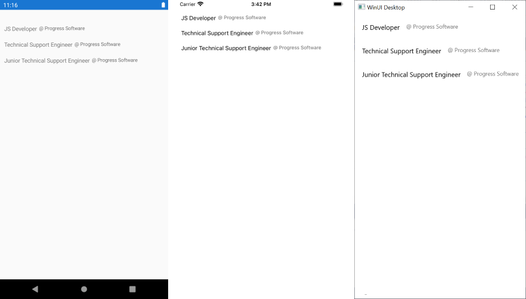

# Configuration

The ItemsControl enables you to define the collection of the rendered items and also to customize their appearance by using the item template.

## Setting the Items Source

To set the items of the ItemsControl and populate them with data, use its `ItemsSource` property:

1. Use the following data item:

 ```C#
public class Experience
{
	public string Title { get; set; }
	public string Company { get; set; }
}
 ```

1. Create a `ViewModel` class and define a collection of `Experience` objects:

 ```C#
public class ViewModel
{
    public ViewModel()
    {
        this.Experiences = new ObservableCollection<Experience>()
        {
            new Experience() { Title = "JS Developer", Company = "@ Progress Software" },
            new Experience() { Title = "Technical Support Engineer", Company = "@ Progress Software" },
            new Experience() { Title = "Junior Technical Support Engineer", Company = "@ Progress Software" },
        };
    }

    public ObservableCollection<Experience> Experiences { get; set; }
}
 ```

1. Add the ItemsControl definition with the `ItemsSource` and a sample `ItemTemplate` applied:

 ```XAML
<telerikMauiControls:RadItemsControl x:Name="itemsControl"
							      ItemsSource="{Binding Experiences, Mode=TwoWay}">
	<telerikMauiControls:RadItemsControl.BindingContext>
		<local:ViewModel />
	</telerikMauiControls:RadItemsControl.BindingContext>
	<telerikMauiControls:RadItemsControl.ItemTemplate>
		<DataTemplate>
			<StackLayout Margin="10"
						 Spacing="5"
						 Orientation="Horizontal">
				<Label Text="{Binding Title}"
							   FontSize="14"/>
				<Label Text="{Binding Company}"
							   TextColor="#99000000"
							   FontSize="12"/>
			</StackLayout>
		</DataTemplate>
	</telerikMauiControls:RadItemsControl.ItemTemplate>
</telerikMauiControls:RadItemsControl>
 ```

The following image shows the end result.



## Customizing the Appearance

You can customize the visualization of the ItemsControl items and place various controls inside the control for more appealing designs by using the `ItemTemplate` property.

The following example demonstrates how to set the items template and uses the `Experience` objects together with the [Telerik UI for .NET MAUI Border]().

```XAML
<telerikMauiControls:RadItemsControl x:Name="itemsControl"
                                ItemsSource="{Binding Experiences, Mode=TwoWay}">
    <telerikMauiControls:RadItemsControl.BindingContext>
        <local:ViewModel />
    </telerikMauiControls:RadItemsControl.BindingContext>
    <telerikMauiControls:RadItemsControl.ItemTemplate>
        <DataTemplate>
            <telerikMauiControls:RadBorder BorderColor="#DFDFDF"
                                           BorderThickness="0, 0, 0, 1">
                <StackLayout Margin="10"
                        Spacing="5">
                    <Label Text="{Binding Title}"
                            FontSize="14"/>
                    <Label Text="{Binding Company}"
                            TextColor="#99000000"
                            FontSize="12"/>
                </StackLayout>
            </telerikPrimitives:RadBorder>
        </DataTemplate>
    </telerikMauiControls:RadItemsControl.ItemTemplate>
</telerikMauiControls:RadItemsControl>
```

The following image shows the end result.


## See Also

- [Getting Started with Telerik UI for .NET MAUI ItemsControl]()
