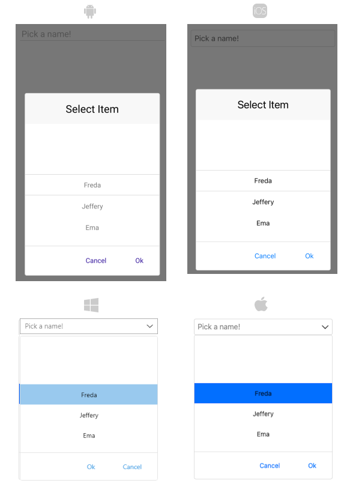

# Getting Started

This guide demonstrates how to add Telerik UI for .NET MAUI ListPicker control to your application.

At the end, you will be able to achieve the following result:


	
## Prerequisites

Before adding the ListPicker, first you need to [setup your .NET MAUI app](#setup-your-net-maui-app), and [download](#download-telerik-ui-for-net-maui) and [install Telerik UI for .NET MAUI](#install-telerik-ui-for-net-maui).

## Define RadListPicker control

1. When the app is setup, you are ready to add a RadDatePicker control to your page:

 ```XAML
<telerikInput:RadListPicker Placeholder="Pick a name!" 
							ItemsSource="{Binding Items}" 
							DisplayMemberPath="FullName">
	<telerikInput:RadListPicker.BindingContext>
		<local:PeopleViewModel/>
	</telerikInput:RadListPicker.BindingContext>
	<telerikInput:RadListPicker.ItemTemplate>
		<DataTemplate>
			<Label Text="{Binding Name}" 
				   HorizontalTextAlignment="Center" 
				   VerticalTextAlignment="Center"/>
		</DataTemplate>
	</telerikInput:RadListPicker.ItemTemplate>
</telerikInput:RadListPicker>
 ```

2. Add a sample ViewModel class:

 ```C#
public class PeopleViewModel
{
	public PeopleViewModel()
	{
		this.Items = new ObservableCollection<Person>()
		{
			new Person("Freda","Curtis"),
			new Person("Jeffery","Francis"),
			new Person("Ema","Lawson"),
			new Person("Niki","Samaniego"),
			new Person("Jenny","Santos"),
			new Person("Eric","Wheeler"),
			new Person("Emmett","Fuller"),
			new Person("Brian","Johnas"),
		};
	}

	public ObservableCollection<Person> Items { get; set; }
}
 ```

3. Create the Business model:

 ```C#
public class Person
{
	public Person(string name, string lastName)
	{
		this.Name = name;
		this.LastName = lastName;
	}

	public string Name { get; set; }

	public string LastName { get; set; }

	public string FullName
	{
		get
		{
			return $"{this.Name} {this.LastName}";
		}
	}
}
 ```

4. Add the following namespace:

 ```XAML
 xmlns:telerikInput="clr-namespace:Telerik.XamarinForms.Input;assembly=Telerik.Maui.Controls.Compatibility"
 ```

5. Register the Telerik controls through `Telerik.Maui.Controls.Compatibility.UseTelerik` extension method called inside the `Configure` method of the **Startup.cs** file of your project:

 ```C#
using Telerik.Maui.Controls.Compatibility;

 public void Configure(IAppHostBuilder appBuilder)
 {
    appBuilder        
        .UseTelerik()
        .UseMauiApp<App>();    
 }              
 ```
 
## See Also

- [Looping]()
- [Templates]()
- [Styling]()
- [Visual Structure]()
