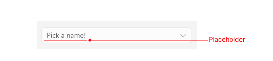
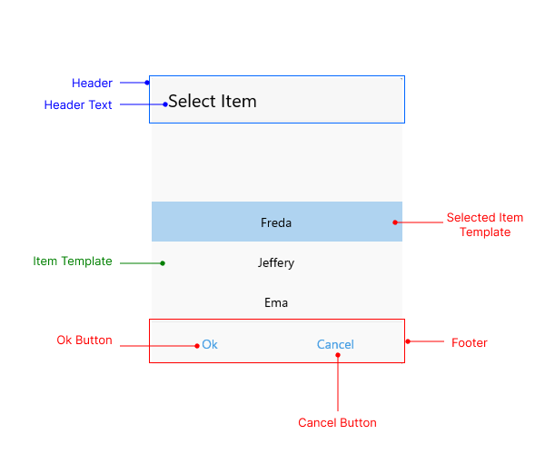

# Visual Structure

Here are described all visual elements used in the List Picker for .NET MAUI.

## List Picker Structure before and after an item is selected

## ListPicker Popup Visual Structure

## Legend

- **Placeholder** - the text visualized before picking an item from the list of items. Placeholder could be customized through the [PlaceholderTemplate](#placeholder-template) property.
- **DisplayStringFormat** - the text vislualized after an item from the list of items is picked.
- **Header** - the text displayed in the popup header. It could be set a direct text through the [HeaderLabelText]() property or fully customize the popup header using the [HeaderTemplate](#header-template) property
- **ItemTemplate**  - Defines the template used for displaying the list of items. For more information review [Templates]() article. 
- **SelectedItemTemplate** - Specifies the template used for visualizing the selected item from the list. For more information review [Templates]() article. 
- **Footer** - the footer of the popup. By default is contains OK and Cancel Buttons. It could be customized through the FooterTemplate property. For more information review [Templates]() article. 