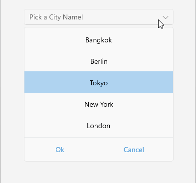

# Looping

The ListPicker for .NET MAUI provides a looping functionality which allows you to loop the list of items after reaching the last item.

You can achieve this by setting the `IsLooping`(`bool`) property to `true`.

## Example

1. Define the ListPicker:

 <snippet id='listpicker-features-looping' />
 ```XAML
<telerik:RadListPicker Placeholder="Pick a City Name!"
							IsLooping="True"
							ItemLength="40"
							ItemSpacing="3"
							ItemsSource="{Binding Items}"
							DisplayMemberPath="Name">
		<telerik:RadListPicker.BindingContext>
			<local:CitiesViewModel/>
		</telerik:RadListPicker.BindingContext>
		<telerik:RadListPicker.ItemTemplate>
			<DataTemplate>
				<Label Text="{Binding Name}"
					   HorizontalTextAlignment="Center"
					   VerticalTextAlignment="Center"/>
			</DataTemplate>
		</telerik:RadListPicker.ItemTemplate>
	</telerik:RadListPicker>
 ```

1. Define a sample business model:

 <snippet id='listpicker-features-businessmodel' />
 ```C#
public class City
{
	public string Name { get; set; }
	public int Population { get; set; }
}
 ```

1. Set the `ViewModel`:

 <snippet id='listpicker-features-viewmodel' />
 ```C#
public class CitiesViewModel
{
	public CitiesViewModel()
	{
		this.Items = new ObservableCollection<City>
		{
			new City { Name = "Tokyo", Population = 13929286 },
			new City { Name = "New York", Population = 8623000 },
			new City { Name = "London", Population = 8908081 },
			new City { Name = "Madrid", Population = 3223334 },
			new City { Name = "Los Angeles", Population = 4000000},
			new City { Name = "Paris", Population = 2141000 },
			new City { Name = "Beijing", Population = 21540000 },
			new City { Name = "Singapore", Population = 5612000 },
			new City { Name = "New Delhi", Population = 18980000 },
			new City { Name = "Bangkok", Population = 8305218 },
			new City { Name = "Berlin", Population = 3748000 },
		};
	}

	public ObservableCollection<City> Items { get; set; }
}
 ```


The following image shows the end result.



>important For a sample looping example, refer to the **ListPicker/Looping** folder of the [Telerik UI for .NET MAUI SDKBrowser Application]().

## See Also

- [Templates]()
- [Styling]()
- [Selection]()
- [Commands]()
