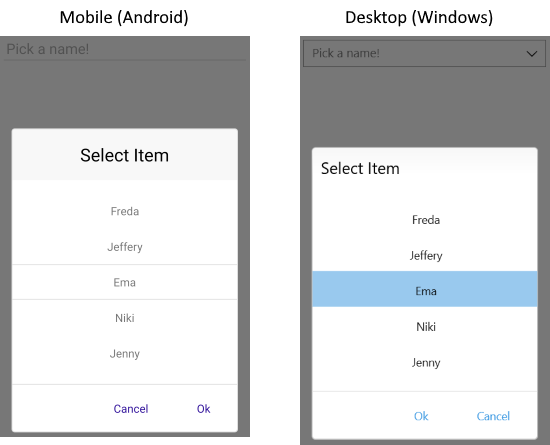
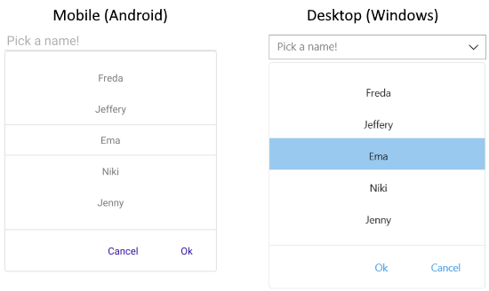

---
title: Picker Mode
page_title: .NET MAUI ListPicker Documentation - Picker Mode
description: "Define PickerMode of Telerik ListPicker for .NET MAUI to either DropDown or Popup."
position: 5
slug: listpicker-picker-mode
---  

# Picker Mode

The ListPicker for .NET MAUI exposes `PickerMode` property of `Telerik.XamarinForms.Input.PickerMode` type which can be set to one of the following values:

* `Popup`&mdash;Shows the UI for picking a date inside a popup. It's the default value for mobile (Android and iOS);
* `DropDown`&mdash; Opens the UI for picking a date inside a dropdown. It's the default value for Desktop (Windows, macOS);

Here is a sample of `PickerMode` set to `Popup`:

```XAML
<telerik:RadListPicker PickerMode="Popup"  />
```

Check below the result on mobile and desktop:



Quick example of `PickerMode` set to `DropDown`:

```XAML
<telerik:RadListPicker PickerMode="DropDown"  />
```

Check the result of `DropDown` mode on mobile and desktop:



> Go to [Getting Started]() topic for the complete example with the ListPicker control.

## Toggle Button

In addition, ListPicker exposes `IsToggleButtonVisible` property which when set to `True` renders an "arrow" button for opening the UI for picking a date. By default, `IsToggleButtonVisible` is enabled for Desktop together with the `DropDown` picker mode, and is disabled for mobile platforms. Still, you can explicitly apply it in both cases:

```XAML
<telerik:RadListPicker PickerMode="DropDown"
							IsToggleButtonVisible="True" />
```

## See Also

- [Templates]()
- [Styling]()
- [Commands]()
- [Selection]()
