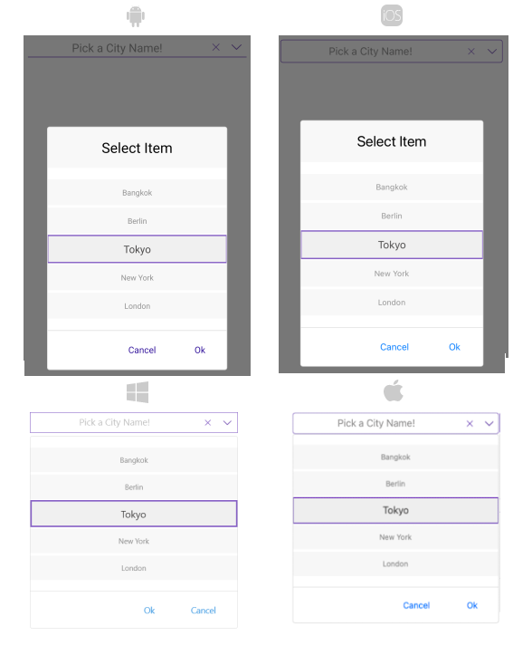

# .NET MAUI ListPicker Styling

The ListPicker control for .NET MAUI provides styling options for customizing its appearance. You can style the ListPicker itself, as well as its popup or dropdown depending on the [PickerMode]() setting.

The control supports the following styling properties:

* `ItemStyle`(of type `Style` with target type `telerik:SpinnerItemView`)&mdash;Defines the style applied to the list of items.
* `SelectedItemStyle`(of type `Style` with target type `telerik:SpinnerItemView`)&mdash;Defines the style applied to the selected item.
* `SelectionHighlightStyle`(of type `Style` with target type `telerik:RadBorder`)&mdash;Specifies the style applied to the border where the current selection is.  
* `PlaceholderLabelStyle`(of type `Style` with target type `Label`)&mdash;Defines the style applied to the placeholder label.
* `DisplayLabelStyle`(of type `Style` with target type `Label`)&mdash;Defines the style applied to the label which is visualized when item of the list is selected.
* `BackgroundColor`&mdash;Defines the background color of the picker.
* `BorderColor`&mdash;Defines the border color of the picker.
* `BorderThickness`&mdash;Specifies the border thickness of the picker. The default value is `new Thickness(0,0,0,1)`.
* `CornerRadius`&mdash;Specifies the corner radius of the picker.

## Namespaces

Using `ItemStyle`, `SelectedItemStyle`, `PopupViewStyle`, `HeaderStyle`, `FooterStyle`, `SelectionHighlightStyle` you need to add the following namespace:

```XAML
xmlns:telerik="http://schemas.telerik.com/2022/xaml/maui"
```

## Styling Examples

The following examples show how the styling properties are applied.

1. Define the ListPicker:

<snippet id='listpicker-style' />

Define the styles in the page resources:

**Define the ItemStyle**

<snippet id='listpicker-features-itemstyle' />

**Define the SelectedItemStyle**

<snippet id='listpicker-features-selecteditemstyle' />

**Define the PlaceholderLabelStyle**

<snippet id='listpicker-style-placeholder-label-style' />

**Define the DisplayLabelStyle**

<snippet id='listpicker-style-display-label-style' />

1. Define a sample business model:

 <snippet id='listpicker-features-businessmodel' />

1. Set a `ViewModel`:

 <snippet id='listpicker-features-viewmodel' />

1. Add the following namespaces:

 ```XAML
xmlns:telerik="http://schemas.telerik.com/2022/xaml/maui"
 ```

The following image shows how the ListPicker looks when the styling properties are applied:



>important For a sample styling example, refer to the **ListPicker/Styling** folder of the [Telerik UI for .NET MAUI SDKBrowser Application]().

## See Also

- [Popup Styling]()
- [DropDown Styling]()
- [Looping]()
- [Templates]()
